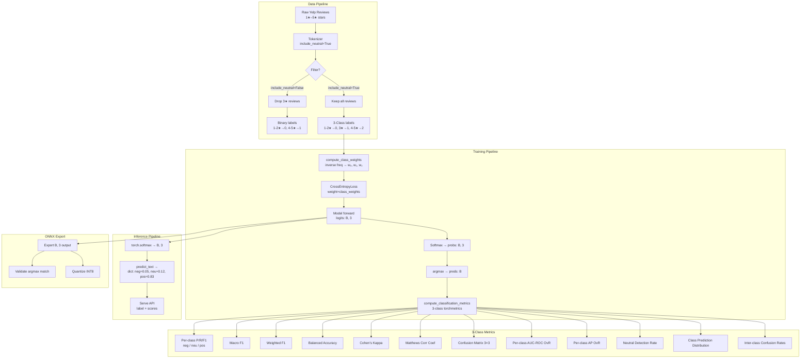

# 3-Class Classification Migration Plan

> **Status: COMPLETED** — All changes from this plan have been implemented and tested.
> See `AGENTS.md` for current conventions and the 3-class section in `docs/troubleshooting.md` for migration issues.
> Key source files: `sentimentizer/config.py` (NUM_CLASSES=3, LABEL_NAMES), `sentimentizer/metrics.py` (ClassificationMetrics with per-class fields), `sentimentizer/models/base.py` (predict_text returns dict), `sentimentizer/trainer.py` (CrossEntropyLoss with class_weights), `sentimentizer/losses.py` (FocalCrossEntropyLoss).

## Background

The models currently train on binary labels (1-2★ → negative, 4-5★ → positive) with 3-star neutral reviews **dropped** from training data. At inference, these models assign neutral reviews to either positive or negative with high confidence — they have no concept of "neutral."

Diagnostic results on 2,000 3-star reviews per model show a **bimodal distribution** (peaks near 0.0 and 1.0, not 0.5):

| Model   | 3-star median | 3-star std | Peak at 0.0-0.1 | Peak at 0.9-1.0 |
|---------|---------------|------------|------------------|------------------|
| RNN     | 0.405         | 0.420      | 34.5%            | 32.6%            |
| Encoder | 0.379         | 0.379      | 28.1%            | 23.7%            |
| Decoder | 0.325         | 0.445      | 40.1%            | 37.8%            |

A threshold band around 0.5 catches only 6-13% of neutral reviews — the only viable solution is **3-class retraining**.

## Label Mapping

| Stars | Old Label | New Label | Class Name |
|-------|-----------|-----------|------------|
| 1-2   | 0.0       | 0         | negative   |
| 3     | (dropped) | 1         | neutral    |
| 4-5   | 1.0       | 2         | positive  |

---

## Architecture Flow (Mermaid)



---

## Output Shape Contract

All models must follow this contract after migration:

| Method | Input | Output | Notes |
|--------|-------|--------|-------|
| `forward()` | `(B, seq_len)` | `(B, num_classes)` | Raw logits, **never squeeze** |
| `predict()` | `(B, seq_len)` ndarray | `(B, num_classes)` tensor | Softmax probabilities |
| `predict_text()` | `str` | `dict[str, float]` | `{"negative": 0.05, "neutral": 0.12, "positive": 0.83}` |

`LABEL_NAMES = ["negative", "neutral", "positive"]` — class index maps to label name.

---

## PR Structure (Incremental Rollout)

Each PR is independently mergeable with tests passing at every step. A `NUM_CLASSES` config flag allows dual-mode operation during transition.

---

## PR 1: Configuration & Data Pipeline

### `sentimentizer/config.py`

- Add `NUM_CLASSES: int = 3` module-level constant
- Add `LABEL_NAMES: list[str] = ["negative", "neutral", "positive"]` module-level constant — shared across `metrics.py`, `models/base.py`, `serve.py`, `exporter.py` (import from config rather than duplicating on each class)
- Add `num_classes: int = 3` field to `RNNConfig`, `EncoderConfig`, `DecoderConfig`
- Add `include_neutral: bool = True` to `TokenizerConfig`
- Add `include_neutral`/`num_classes` consistency validation:
  ```python
  if config.include_neutral and config.num_classes != 3:
      raise ValueError(f"include_neutral=True requires num_classes=3, got {config.num_classes}")
  if not config.include_neutral and config.num_classes != 2:
      raise ValueError(f"include_neutral=False requires num_classes=2, got {config.num_classes}")
  ```
- Replace `pos_weight: float = 1.0` in `TrainerConfig` with `class_weights: list[float] | None = None`
- Add `balance_strategy: str = "class_weights_only"` to `TrainerConfig` (options: `"undersample"`, `"oversample"`, `"class_weights_only"`)
- Add `weight_smoothing: float = 0.5` — exponent on inverse-frequency weights (`1.0` = full, `0.5` = sqrt, `0.0` = uniform). ⚠️ **Consider renaming to `weight_exponent`** to avoid confusion with `label_smoothing` in the same config.
- Add `loss_type: str = "cross_entropy"` — options: `"cross_entropy"`, `"focal"`
- Add `focal_gamma: float = 2.0` — focal loss focusing parameter (only used when `loss_type="focal"`)
- Add `label_smoothing: float = 0.1` — softens hard targets, reduces overconfident predictions
- Add `neutral_oversample_ratio: float = 0.0` — `0.0` = disabled, `0.20` = oversample neutral to 20% of training data

### `sentimentizer/tokenizer.py`

- **`convert_rating()`**: Change from binary float to 3-class integer:
  ```python
  def convert_rating(rating: int) -> int:
      if rating >= 4: return 2   # positive
      elif rating == 3: return 1  # neutral
      else: return 0              # negative
  ```
- **`vectorized_convert_ratings()`**: Use `np.select`:
  ```python
  def vectorized_convert_ratings(stars: np.ndarray) -> np.ndarray:
      return np.select([stars <= 2, stars == 3, stars >= 4], [0, 1, 2]).astype(np.int64)
  ```
- **`transform_dataframe()`**: Conditional filter:
  ```python
  if not self.cfg.include_neutral:
      data = data[data[self.cfg.label_col] != 3].copy()
  ```
- **`transform_dataset()`**: Same conditional filter for Ray path
- **`transform()`** (unified entry point — **must also be updated**): Currently hardcodes `data_source.filter(col=cfg.label_col, op="ne", value=3)` to drop 3-star reviews. Make conditional:
  ```python
  if not self.cfg.include_neutral:
      filtered = data_source.filter(col=cfg.label_col, op="ne", value=3)
  else:
      filtered = data_source  # keep all reviews
  ```
  ⚠️ **This is the most commonly used path.** If only the legacy methods are updated, neutral reviews will still be silently dropped in production.
- **`transform()` also needs `vectorized_convert_ratings` update**: The `transform_batch` closure inside `transform()` calls `vectorized_convert_ratings()` which currently maps to binary `{0.0, 0.5, 1.0}`. After migration it must produce integer `{0, 1, 2}` via the new `np.select` version. The same applies to `transform_dataframe()` and `transform_dataset()`.

### `workflows/stages/tokenize.py`

- Update the Ray tokenization path with the same `include_neutral` conditional filter and `vectorized_convert_ratings()` call

### `workflows/cli.py`

- Add CLI arguments for new config fields so users can configure 3-class training from the command line:
  - `--num-classes` (int, default 3)
  - `--include-neutral` / `--no-include-neutral` (bool flag, default True)
  - `--loss-type` (choice: `cross_entropy`, `focal`)
  - `--focal-gamma` (float, default 2.0)
  - `--label-smoothing` (float, default 0.1)
  - `--weight-smoothing` (float, default 0.5)
  - `--neutral-oversample-ratio` (float, default 0.0)
  - `--balance-strategy` (choice: `class_weights_only`, `undersample`, `oversample`)
- Without these CLI arguments, users can only set these via config files or programmatic API, not from the command line.

### `sentimentizer/loader.py`

- **`compute_class_weights()`** (replaces `compute_pos_weight()`):
  ```python
  def compute_class_weights(
      df, target_col="target", num_classes=3, smoothing: float = 1.0
  ) -> torch.Tensor:
      """Compute inverse-frequency class weights with optional smoothing.

      Args:
          smoothing: Exponent applied to raw weights. 1.0 = full inverse-frequency,
              0.0 = uniform weights, 0.5 = square-root smoothing (recommended).
      """
      counts = [(df[target_col] == i).sum() for i in range(num_classes)]
      total = sum(counts)
      raw = [total / (num_classes * max(c, 1)) for c in counts]
      # Apply smoothing exponent, then normalize so mean weight = 1.0
      smoothed = [w ** smoothing for w in raw]
      mean_w = sum(smoothed) / len(smoothed)
      weights = torch.tensor(
          [w / mean_w for w in smoothed], dtype=torch.float32
      )
      return weights
  ```
  With the expected Yelp distribution (neg 18%, neu 11%, pos 71%):
  - `smoothing=1.0` (full): `[1.85, 3.03, 0.47]` — aggressive, may over-correct
  - `smoothing=0.5` (sqrt): `[1.36, 1.74, 0.69]` — recommended starting point
  - `smoothing=0.0` (uniform): `[1.0, 1.0, 1.0]` — no correction
- **`_balance_dataframe()`**: When `num_classes > 2`, support targeted oversampling via `_oversample_minority()`. Use `df.sample(n=target, replace=True)` (no sklearn dependency). Preserve `balance_strategy` config option. **Critical**: Undersampling to the minority (neutral ~11%) would destroy 89% of the data. Default strategy is `class_weights_only`.
- **`_oversample_minority()`** (new function):
  ```python
  def _oversample_minority(
      df, target_col="target", minority_class=1,
      target_ratio=0.20, random_state=42,
  ) -> pd.DataFrame:
      """Oversample a specific class to reach target_ratio of total.

      Unlike full rebalancing (6.5× duplication), targets a moderate
      ratio that preserves natural class frequency ranking.
      """
      minority_df = df[df[target_col] == minority_class]
      other_df = df[df[target_col] != minority_class]
      target_count = int(len(other_df) * target_ratio / (1 - target_ratio))
      if target_count <= len(minority_df):
          return df
      oversampled = minority_df.sample(
          n=target_count, replace=True, random_state=random_state
      )
      return pd.concat([other_df, oversampled]).sample(
          frac=1, random_state=random_state
      )
  ```
  Called when `neutral_oversample_ratio > 0.0`. Full oversampling to 33% risks overfitting to specific neutral phrasings — target 15–20% instead.
- **`_balance_ray_dataset()`**: Same strategy update for the Ray path
- **`CorpusDataset.__init__()`**: Change `_y_data` dtype from `torch.float32` to `torch.long` (required for `CrossEntropyLoss`)
- **Keep `compute_pos_weight()`** as deprecated alias, but raise `ValueError` if called when `num_classes > 2` — silently computing a binary pos_weight for 3-class data would be incorrect and hard to debug.

### `sentimentizer/data_source.py`

- **Audit and update** any binary-specific logic (star-to-label conversion, filtering). This file may have rating-to-label mappings that assume binary classification.

### Critical bug fixes (from review)

- **Three `.float()` casts on targets in Ray distributed path** — all must be changed to `.long()` for `CrossEntropyLoss`:
  1. `_iter_batches()` line ~515: `batch["target"].float().to(device)` → `batch["target"].long().to(device)`
  2. `_train_func()` training loop line ~1135: `target=batch["target"].float().to(device)` → `target=batch["target"].long().to(device)`
  3. `_train_func()` validation block line ~1153: `target = batch["target"].float().to(device)` → `target = batch["target"].long().to(device)`
  - ⚠️ The DataLoader path (`Trainer._train_epoch()` and `Trainer.evaluate()`) does **NOT** cast to `.float()` — it just does `target.to(device)`. So only the Ray path needs fixing, but the bug would only manifest in distributed training, making it hard to catch in unit tests.
- Audit every `.to(device)` call on targets to ensure no `.float()` cast slips through.

---

## PR 2: Model Architecture & Output Contract

### `sentimentizer/models/base.py`

- Add `LABEL_NAMES = ["negative", "neutral", "positive"]` class constant (also import from `config.py` for consistency)
- Add `NUM_CLASSES = 3` class constant (also import from `config.py`)
- **`predict()`**: Replace `torch.sigmoid(self.forward(x))` with `torch.softmax(self.forward(x), dim=-1)` — returns `(B, num_classes)` probability matrix
- **`predict_text()`**: Return `dict[str, float]` instead of `float`:
  ```python
  def predict_text(self, text: str) -> dict[str, float]:
      token_ids = self.tokenizer.tokenize_text(text)
      probs = self.predict(token_ids)  # (1, num_classes)
      return {label: probs[0, i].item() for i, label in enumerate(self.LABEL_NAMES)}
  ```
  ⚠️ **Breaking change**: Any consumer doing `score = model.predict_text(text)` (expecting `float`) will get a `dict` instead. Add a deprecation path: keep the old `predict_text()` returning `float` for one version with a `FutureWarning`, and add `predict_text_multiclass()` as the new method. Or emit a `TypeError` guide if the return value is used in a comparison (`score > 0.5`). At minimum, document this as a **major version change** in the API.

### `sentimentizer/models/rnn.py`

- **Classifier head**: `nn.Linear(hidden_size, 1)` → `nn.Linear(hidden_size, num_classes)`
- **`forward()`**: Remove `torch.squeeze(logits)` — return `(B, num_classes)` instead of `(B,)`
- **`new_model()`**: Accept and pass `num_classes` from config
- **`get_trained_model()`**: Infer `num_classes` from `weights["classifier.3.weight"].shape[0]` (final linear layer). If `shape[0] == 1`, raise `RuntimeError` with retraining instructions. Also check for `_metadata` key in weights dict for robust detection.

### `sentimentizer/models/encoder.py`

- Same pattern: `nn.Linear(d_model, 1)` → `nn.Linear(d_model, num_classes)` in classifier
- Remove `torch.squeeze(logits)` from `forward()`
- Update `new_model()` and `get_trained_model()`

### `sentimentizer/models/decoder.py`

- Same pattern: `nn.Linear(d_model, 1)` → `nn.Linear(d_model, num_classes)`
- Remove `torch.squeeze(logits)` from `forward()`
- Update `new_model()` and `get_trained_model()`

### `workflows/helpers.py`

- `_load_model()` and `_get_model_config()` must pass `num_classes` to model constructors

### Weight metadata saving

When saving model weights, save metadata alongside:
```python
torch.save({"model_state_dict": state_dict, "num_classes": 3, "_metadata": {"num_classes": 3}}, path)
```
On load, check `_metadata` first, fall back to shape inference.

---

## PR 3: Metrics Migration

### `sentimentizer/metrics.py`

#### New `ClassificationMetrics` dataclass

```python
@dataclass
class ClassificationMetrics:
    total: int
    accuracy: float
    balanced_accuracy: float                     # ★NEW

    # Per-class metrics (indexed by LABEL_NAMES order)
    negative_precision: float
    negative_recall: float
    negative_f1: float
    neutral_precision: float
    neutral_recall: float                       # = neutral_detection_rate
    neutral_f1: float
    positive_precision: float
    positive_recall: float
    positive_f1: float

    # Per-class AUC-ROC (OvR)
    negative_auc_roc: float | None               # ★NEW
    neutral_auc_roc: float | None               # ★NEW
    positive_auc_roc: float | None               # ★NEW

    # Per-class Average Precision (OvR PR-AUC)
    negative_avg_precision: float | None          # ★NEW
    neutral_avg_precision: float | None           # ★NEW — most important for minority class
    positive_avg_precision: float | None           # ★NEW

    # Aggregate
    macro_f1: float
    weighted_f1: float

    # Confusion
    confusion_matrix: list[list[int]]             # 3×3
    neutral_to_positive_rate: float              # ★NEW — FN_neutral_pred_as_positive / total_true_neutral
    neutral_to_negative_rate: float              # ★NEW — FN_neutral_pred_as_negative / total_true_neutral

    # Prediction distribution
    pred_negative_frac: float                     # ★NEW
    pred_neutral_frac: float                      # ★NEW
    pred_positive_frac: float                     # ★NEW

    # Advanced
    cohen_kappa: float
    mcc: float
```

**Removed fields** (binary-specific): `positive_accuracy`, `negative_accuracy`, `precision`, `recall`, `f1`, `npv`, `auc_roc`, `avg_precision`, `tp`, `tn`, `fp`, `fn`

- **`to_dict()`**: Must be rewritten for the new field names. Current implementation references `self.tp`, `self.tn`, etc. Replace with per-class metrics and `confusion_matrix` serialization.

#### `compute_classification_metrics()` changes

- **Signature**: Change `probabilities` parameter from shape `(N,)` to `(N, num_classes)`
- **Predictions**: `predictions = probabilities.argmax(axis=1)` instead of `(probabilities >= 0.5).astype(int)`
- **Targets**: Must be integer class indices `0, 1, 2` (not floats)
- **Replace all `Binary*` torchmetrics** with `Multiclass*` (`num_classes=3`):
  - `BinaryPrecision` → `MulticlassPrecision(num_classes=3, average=None)` for per-class
  - `BinaryRecall` → `MulticlassRecall(num_classes=3, average=None)`
  - `BinaryF1Score` → `MulticlassF1Score(num_classes=3, average=None)`
  - `BinaryCohenKappa` → `CohenKappa(task="multiclass", num_classes=3)`
  - `BinaryMatthewsCorrCoef` → `MatthewsCorrCoef(task="multiclass", num_classes=3)`
  - `BinaryAUROC` → `MulticlassAUROC(num_classes=3)`
  - `BinaryAveragePrecision` → `MulticlassAveragePrecision(num_classes=3)`
  - ⚠️ **Note**: The current code already uses `MulticlassF1Score(num_classes=2, average="macro")` for `macro_f1`. This must be changed to `MulticlassF1Score(num_classes=3, average="macro")` — it's not a `Binary*` → `Multiclass*` replacement, just a `num_classes` parameter change.
- **`_replace_nan_probs()`**: Accept `(N, num_classes)` shape. Replace NaN values with `1/num_classes`. For rows with partial NaN (e.g., `[0.7, NaN, 0.3]`), zero the NaN positions and re-normalize the row to sum to 1.0
- **Balanced accuracy**: Compute as mean of per-class recalls
- **Inter-class confusion rates**: Extract from confusion matrix `cm[1, 2] / cm[1].sum()` etc.
- **Prediction distribution**: Compute as `np.bincount(predictions, minlength=3) / len(predictions)`

#### `compute_metrics_from_model()` changes (lines 231-287)

- Replace `torch.sigmoid(logits).squeeze(-1)` with `torch.softmax(logits, dim=-1)`
- Replace `(probs >= 0.5).long()` with `probs.argmax(dim=-1)`
- Replace `targets_binary = (targets >= 0.5).long()` with `targets.long()`
- Pass full `(N, 3)` probability matrix to `compute_classification_metrics()`

#### `compute_metrics_from_examples()` changes (lines 290-373)

- Currently binary-only (`"positive"` / `"negative"` strings). Must support 3-class:
  - Accept `"neutral"` as an `expected` value
  - Map expected labels to class indices: `{"negative": 0, "neutral": 1, "positive": 2}`
  - Replace `Binary*` torchmetrics with `Multiclass*` (same as `compute_classification_metrics()`)
  - Update probability handling: `result.get("scores")` returns `dict[str, float]` instead of scalar

### `sentimentizer/metrics_publisher.py`

- **`_METRIC_GAUGE_KEYS`**: Replace binary keys with 3-class per-class keys:
  ```python
  _METRIC_GAUGE_KEYS = {
      "accuracy": "accuracy",
      "balanced_accuracy": "balanced_accuracy",
      "negative_precision": "negative_precision",
      "negative_recall": "negative_recall",
      "negative_f1": "negative_f1",
      "neutral_precision": "neutral_precision",
      "neutral_recall": "neutral_recall",
      "neutral_f1": "neutral_f1",
      "positive_precision": "positive_precision",
      "positive_recall": "positive_recall",
      "positive_f1": "positive_f1",
      "neutral_auc_roc": "neutral_auc_roc",
      "neutral_avg_precision": "neutral_avg_precision",
      "macro_f1": "macro_f1",
      "weighted_f1": "weighted_f1",
      "neutral_to_positive_rate": "neutral_to_positive_rate",
      "neutral_to_negative_rate": "neutral_to_negative_rate",
      "pred_neutral_frac": "pred_neutral_frac",
      "cohen_kappa": "cohen_kappa",
      "mcc": "mcc",
  }
  ```
- **`write_epoch_metrics_to_file()`**: Update JSON field names
- **`_set_prometheus_gauges()`**: Update gauge map
- **`_set_ray_gauges()`**: Update Ray gauge dict
- **`publish_epoch_metrics()`**: Update structured log message

### `sentimentizer/exporter.py`

- Replace binary-specific gauges with per-class gauges:
  - Remove: `TRAINING_VAL_POSITIVE_ACCURACY`, `TRAINING_VAL_NEGATIVE_ACCURACY`, `TRAINING_VAL_PRECISION`, `TRAINING_VAL_RECALL`, `TRAINING_VAL_F1`, `TRAINING_VAL_NPV`, `TRAINING_VAL_AVG_PRECISION`
  - Add: `TRAINING_VAL_NEGATIVE_PRECISION`, `TRAINING_VAL_NEGATIVE_RECALL`, `TRAINING_VAL_NEGATIVE_F1`, `TRAINING_VAL_NEUTRAL_PRECISION`, `TRAINING_VAL_NEUTRAL_RECALL`, `TRAINING_VAL_NEUTRAL_F1`, `TRAINING_VAL_POSITIVE_PRECISION`, `TRAINING_VAL_POSITIVE_RECALL`, `TRAINING_VAL_POSITIVE_F1`, `TRAINING_VAL_BALANCED_ACCURACY`, `TRAINING_VAL_MACRO_F1`, `TRAINING_VAL_WEIGHTED_F1`, `TRAINING_VAL_NEUTRAL_AUC_ROC`, `TRAINING_VAL_NEUTRAL_AVG_PRECISION`, `TRAINING_VAL_NEUTRAL_TO_POSITIVE_RATE`, `TRAINING_VAL_NEUTRAL_TO_NEGATIVE_RATE`, `TRAINING_VAL_PRED_NEUTRAL_FRAC`

### `sentimentizer/trainer.py`

- **`_create_training_components()`**:
  - Remove `pos_weight` parameter
  - Accept `class_weights: torch.Tensor` and `cfg: TrainerConfig` parameters
  - ⚠️ **All call sites must be updated**: `new_trainer()` (~line 850), `_train_func()` (~line 997), and `tests/test_callbacks.py` all call this function. The signature change from `(model, model_type, device, pos_weight)` to `(model, model_type, device, class_weights, cfg)` affects every caller. `Trainer.fit()` does **not** call this function directly — it uses the loss function stored on `self.loss_function` which is set by `new_trainer()`.
  - Construct loss based on `cfg.loss_type`:
    ```python
    if cfg.loss_type == "focal":
        loss_function = FocalCrossEntropyLoss(
            weight=class_weights.to(device),
            gamma=cfg.focal_gamma,
            label_smoothing=cfg.label_smoothing,
        )
    else:
        loss_function = CrossEntropyLoss(
            weight=class_weights.to(device),
            label_smoothing=cfg.label_smoothing,
        )
    ```
- **`FocalCrossEntropyLoss`** (new class — **place in `sentimentizer/losses.py`**, not `trainer.py`): Separation of concerns, easier to unit-test in isolation, follows pattern of `metrics.py` being separate from `trainer.py`. Import as `from sentimentizer.losses import FocalCrossEntropyLoss`.
  ```python
  class FocalCrossEntropyLoss(torch.nn.Module):
      """CrossEntropyLoss with focal modulation for hard-example mining.

      Down-weights easy (high-confidence) predictions, focusing training
      on hard cases like ambiguous neutral reviews.
      Ref: Lin et al., "Focal Loss for Dense Object Detection" (2017)
      """
      def __init__(self, weight=None, gamma=2.0, label_smoothing=0.0):
          super().__init__()
          self.gamma = gamma
          self.ce = torch.nn.CrossEntropyLoss(
              weight=weight, reduction="none",
              label_smoothing=label_smoothing,
          )

      def forward(self, logits, targets):
          ce_loss = self.ce(logits, targets)           # (B,)
          p_t = torch.softmax(logits, dim=-1).gather(
              1, targets.unsqueeze(1)
          ).squeeze(1)                                 # (B,)
          return ((1.0 - p_t) ** self.gamma * ce_loss).mean()
  ```
- **`compute_epoch_metrics()`**:
  - Change `probabilities` parameter from `(N,)` to `(N, num_classes)`
  - `predictions = probabilities.argmax(axis=1)` instead of threshold at 0.5
- **`Trainer.evaluate()`** and **`_run_training_loop()`**:
  - Replace `torch.sigmoid(logits)` with `torch.softmax(logits, dim=-1)` at all call sites
  - Accumulate `(N, num_classes)` probabilities instead of `(N,)`
- **`RayReportCallback.on_epoch_end()`**:
  - Update `train.report()` dict from binary fields to 3-class per-class fields
- **`_train_func()` (~line 1107)**: Has its **own** `BCEWithLogitsLoss` construction (does NOT call `_create_training_components()`). Must be replaced with the same `CrossEntropyLoss`/`FocalCrossEntropyLoss` logic. Also update `train_loop_config` dict (~line 1388) to pass `class_weights` and `loss_type` instead of `pos_weight`.
- **`_run_fit_distributed()` (~line 1375)**: The `train_loop_config` dict passes `pos_weight` to Ray workers. Replace with `class_weights`, `loss_type`, `focal_gamma`, and `label_smoothing`.

### `workflows/stages/train.py`

- Remove `pos_weight` computation/setting
- Add `class_weights` computation from training data (pass `smoothing=cfg.weight_smoothing`)
- If `cfg.neutral_oversample_ratio > 0.0`, call `_oversample_minority()` on training data before weight computation
- Update `_reset_stale_metrics()` for new metric gauge names
- Update `_persist_metrics_to_file()` for new `ClassificationMetrics` fields

### `scripts/generate_ray_dashboards.py`

- Update all PromQL queries and panel definitions to reference new gauge names
- Add panels for neutral-class metrics, balanced accuracy, macro F1, neutral detection rate
- ⚠️ **Grafana only reads provisioned dashboards on startup.** After modifying dashboard JSON, run `make start-metrics` to regenerate dashboards and restart Grafana. This must happen after PR 3 is merged.

---

## PR 4: Tuner, Serving, and ONNX

### `sentimentizer/tuner.py`

- Replace `pos_weight` with `class_weights` in `_trainable_wrapper()` and `TrainerConfig`
- Replace `val_positive_accuracy`, `val_negative_accuracy` with per-class metrics in `tune.report()`
- Replace `best_positive_accuracy`, `best_negative_accuracy` in `tune_model()` return dict
- Update `TunePrometheusCallback._update_trial_gauges()` for new metric keys
- Update `compute_metrics_from_model()` call to pass 3-class probabilities

### `sentimentizer/serve/app.py`

- **`_predict_sentiment()`**:
  ```python
  def _predict_sentiment(self, text, model_name=None):
      model, resolved_name = self._get_model(model_name)
      scores = model.predict_text(text)  # returns dict
      label = max(scores, key=scores.get)
      return {
          "model": resolved_name,
          "label": label,
          "scores": scores,
      }
  ```
- **Batch endpoint**: Same format per item
- ⚠️ **Binary-hardcoded lines to change**:
  - Line 186: `"sentiment_score": score` → `"scores": scores` (key rename, scalar → dict)
  - Line 187: `"label": "positive" if score > 0.5 else "negative"` → `"label": max(scores, key=scores.get)`
  - Line 273: `score=prediction["sentiment_score"]` → remove or update kwarg passed to `build_predict_response()`

### `sentimentizer/serve/base.py`

- Update `build_predict_response()` to handle dict scores instead of scalar
- Line 273 caller passes `score=prediction["sentiment_score"]` — after migration, the `score` kwarg becomes `scores=prediction["scores"]` (dict) or remove it from `**log_extra`

### `sentimentizer/export_onnx.py`

- **Dynamic axes**: Keep `{0: "batch_size"}` for output (num_classes is static)
- **`_RNNOnnxWrapper.forward()`**: Must return `(B, num_classes)` — no squeeze
- **`validate_onnx_export()`**: Handle 2D output `(N, num_classes)` instead of 1D `(N,)`. Use `np.argmax(axis=1)` for comparison instead of `>= 0.5`
- **Metadata JSON**: Add `num_classes` and `label_names` fields:
  ```python
  metadata = {
      "num_classes": 3,
      "label_names": ["negative", "neutral", "positive"],
      ...
  }
  ```
  Serving consumers need to know that index 1 = "neutral".

### `workflows/stages/tune.py`

- **Not mentioned in original plan** — must also be updated for 3-class:
  - Replace `pos_weight` with `class_weights` in tuning config
  - Update `TrainerConfig` construction for new fields (`loss_type`, `label_smoothing`, etc.)
  - Update any `compute_metrics_from_model()` calls to pass 3-class probabilities
  - Update trial result reporting for per-class metrics

### `workflows/stages/diagnose.py`

- This file is **environment and pipeline diagnostics only** (no `torch.sigmoid` / model inference). It calls `diagnose_training_issues()` from `sentimentizer/agent/diagnose_model.py`, which is the actual code that needs 3-class updates:
  - Update `diagnose_training_issues()` in `diagnose_model.py` to check for `num_classes=3` in model weights, validate 3-class label distribution, and update imbalance ratio check for 3 classes instead of 2
  - The workflow stage itself (`diagnose.py`) needs no changes — it just prints results

### `sentimentizer/hf.py`

- **Audit and update** for 3-class: model card generation should include `num_classes=3` and `label_names`; model config upload should pass `num_classes`; weight download should handle `_metadata.num_classes` detection (consistent with `get_trained_model()` in PR 2)
- ⚠️ **Binary-hardcoded lines to change**:
- `_format_metrics_section()` lines 134-143: `metric_keys` list references `best_positive_accuracy`, `best_negative_accuracy`, `best_precision`, `best_recall` — replace with per-class metric keys (`best_negative_f1`, `best_neutral_recall`, `best_macro_f1`, etc.)
  - `_format_usage_section()` line 260: `# >0.5 = positive, <0.5 = negative` — update usage example to show `dict` output with 3-class probabilities
  - `_push_to_hub()` in `agent/diagnose_model.py` lines 363-371: passes `best_positive_accuracy`, `best_negative_accuracy` to `push_model_to_hub()` — must match new metric names

### `sentimentizer/agent/diagnose_model.py`

- **`pos_weight` field** in `TrainingConfig` (~line 125): Replace with `class_weights`, `loss_type`, `focal_gamma`, `label_smoothing`, `weight_smoothing`
- **`pos_weight` usage** in `_run_single()` (~line 473) and `_run_distributed()` (~line 549): Pass `class_weights` instead
- **`diagnose_training_issues()`** (~line 900): Update imbalance check from binary (2-class) to 3-class distribution
- ⚠️ **Binary-hardcoded lines to change**:
  - `_validate_model()` line 659: `is_correct = score > 0.5 if expected == "positive" else score < 0.5` — replace with `predicted_label = max(scores, key=scores.get); is_correct = predicted_label == expected`
  - `_validate_model()` lines 694-698: references `metrics_obj.f1`, `metrics_obj.positive_accuracy`, `metrics_obj.negative_accuracy` — these fields are removed in the new `ClassificationMetrics`. Replace with `metrics_obj.macro_f1`, per-class recalls, etc.
  - `KNOWN_SENTIMENT_EXAMPLES` (~line 65): Only has `"positive"` and `"negative"` expected values — add `"neutral"` examples for 3-class validation
  - `_train_final_model()` line 549: `pos_weight=self.config.pos_weight` in `TrainerConfig` constructor — replace with new config fields
  - `diagnose_training_issues()` lines 1000-1021: Class balance check hardcodes `target_counts.get(1.0, ...)` / `target_counts.get(0.0, ...)` with 2-class ratio — update for 3-class `{0, 1, 2}` distribution and per-class ratio reporting

### Test files requiring updates

- **`tests/test_training.py`**: ~10 instances of `nn.BCEWithLogitsLoss()` — replace with `nn.CrossEntropyLoss()` and update target tensors from `.float()` to `.long()`
- **`tests/test_callbacks.py`**: `test_loss_has_pos_weight` (~line 129) — replace with `test_loss_has_class_weights`; 3 instances of `BCEWithLogitsLoss()` in callback tests
- **`tests/test_rnn.py`**: `BCEWithLogitsLoss` assertion (~line 459) and instantiation (~line 559); `pos_weight` in mock config (~line 486)
- **`tests/test_loader.py`**: `test_compute_pos_weight_*` tests (~lines 129-144) — keep as deprecated-path tests, add `test_compute_class_weights_*` tests
- **`tests/test_ray_compat.py`**: `pos_weight` in config dicts (~lines 325, 344)

---

## PR 5: Retrain, Validate, and Update Docs

### Training

- Delete old binary weights
- Retrain all 3 models with `include_neutral=True`, `num_classes=3`
- Use `balance_strategy="class_weights_only"`, `weight_smoothing=0.5`, `label_smoothing=0.1` as baseline
- Run `scripts/diagnose_neutral.py` (updated for 3-class) to verify 3-star reviews cluster around the neutral class
- **Imbalance tuning ladder** (escalate only if `neutral_recall < 0.60`):
  1. Baseline: smoothed class weights + label smoothing
  2. Switch to `loss_type="focal"` with `focal_gamma=2.0`
  3. Add `neutral_oversample_ratio=0.20`
  4. Investigate data quality / curriculum learning

### Imbalance Monitoring Targets

| Metric | Target | Why |
|--------|--------|-----|
| `neutral_recall` | ≥ 0.60 | Primary indicator that the model can find neutral reviews |
| `neutral_avg_precision` | ≥ 0.40 | PR-AUC for neutral — more informative than ROC-AUC for minority class |
| `pred_neutral_frac` | 0.08–0.15 | If < 0.05, model is ignoring neutral entirely |
| `neutral_to_positive_rate` | < 0.30 | Most common failure: neutral miscategorized as positive |
| `balanced_accuracy` | ≥ 0.70 | Mean of per-class recalls — drops when any class is ignored |
| `macro_f1` | ≥ 0.65 | Drops sharply if neutral F1 is near zero |

> **Do not optimize for overall accuracy.** A model that predicts positive for everything achieves ~71% accuracy. Watch `balanced_accuracy` and `macro_f1` instead.

### Hugging Face Hub

- Tag old binary weights as `v1` release
- Upload new 3-class weights as `v2` release
- Update model cards with `num_classes=3` metadata

### `scripts/diagnose_neutral.py`

- Update for 3-class: use `torch.softmax(logits, dim=-1)` instead of `torch.sigmoid(logits)`
- Compare per-class distributions instead of binary histograms
- Add neutral detection rate metric

### Documentation Updates

- **`AGENTS.md`**: Update conventions:
  - `CrossEntropyLoss` instead of `BCEWithLogitsLoss`
  - `num_classes=3` instead of binary
  - Target dtype is `torch.long` (not `torch.float32`)
  - `predict_text()` returns `dict[str, float]` (not `float`)
  - New label mapping: 0=negative, 1=neutral, 2=positive
  - `compute_class_weights()` replaces `compute_pos_weight()`
  - `weight_smoothing` / `weight_exponent` controls class weight aggressiveness
  - `FocalCrossEntropyLoss` in `sentimentizer/losses.py` for hard-example mining
  - `label_smoothing` default is `0.1` for 3-class
  - `_balance_dataframe` supports 3-class strategies
  - NaN replacement uses `1/num_classes` instead of `0.5`
  - `LABEL_NAMES` is the single source of truth in `config.py` — import it, don't duplicate

- **`docs/troubleshooting.md`**: Add section on 3-class migration
- **`docs/metrics.md`**: Update metric definitions for 3-class

---

## Risk Assessment

| Risk | Mitigation |
|------|-----------|
| Old binary weights crash on load | `_metadata.num_classes` check + shape fallback + clear `RuntimeError` message |
| Class imbalance (neutral ~11%) | Layered approach: smoothed class weights (α=0.5) → focal loss (γ=2.0) → targeted oversampling (20%) |
| Over-correction from class weights | `weight_smoothing` parameter (default 0.5) prevents aggressive compensation that sacrifices positive precision |
| Neutral class lower accuracy | Expected — monitor `neutral_recall` and `balanced_accuracy`, not just accuracy |
| Focal loss training instability | `gamma=2.0` is well-studied default; label smoothing acts as regularizer |
| Oversampling overfits neutral class | Target 15–20% (not 33%); monitor train vs val neutral F1 gap for overfitting signal |
| ONNX export shape change | Update dynamic axes, re-validate with `argmax` instead of `>= 0.5` |
| API breaking change | Response includes all 3 probabilities + string label; `predict_text()` returns dict |
| `torch.squeeze` removing class dim | Explicit contract: `forward()` always returns `(B, C)`, no squeeze |
| NaN probs don't sum to 1.0 | `_replace_nan_probs` handles 2D `(N, C)` matrices with row-wise replacement and re-normalization |
| `_iter_batches()` target dtype float→long | Audit all target dtype casts in Ray path |
| Tuner silently computing wrong metrics | Update `compute_metrics_from_model()` to use softmax + argmax |
| `compute_metrics_from_examples()` is binary-only | Update to support 3-class expected labels and multiclass torchmetrics |
| Undersampling destroys 89% of data | Default `balance_strategy="class_weights_only"` |
| Weight detection fragility | Save `_metadata` dict alongside weights |

---

## Test Strategy

### Per-PR tests

1. **PR 1**: Test `convert_rating()` returns 0/1/2; test `vectorized_convert_ratings()` with 3-class; test `CorpusDataset` uses `long` dtype; test all three `.float()→.long()` casts in Ray path (`_iter_batches`, `_train_func` training loop, `_train_func` validation); test `_balance_dataframe()` with 3 classes (oversampling); test `compute_class_weights()` output shapes and values; test `compute_class_weights()` smoothing parameter (`smoothing=0.5` produces sqrt-scaled weights, `smoothing=0.0` produces uniform); test `_oversample_minority()` reaches target ratio without exceeding it; test `transform()` respects `include_neutral` flag; test `include_neutral`/`num_classes` validation rejects inconsistent configs
2. **PR 2**: Test `forward()` returns `(B, 3)`; test `predict()` returns `(B, 3)` softmax; test `predict_text()` returns dict with 3 keys; test old binary weights raise `RuntimeError`; test `num_classes` detection from weight shapes; test `batch_size=1` returns `(1, 3)` not `(3,)`
3. **PR 3**: Test `compute_classification_metrics()` with 3-class data; test per-class metrics are correct; test `_replace_nan_probs()` with `(N, 3)` shape and partial NaN rows; test `compute_metrics_from_model()` with 3-class logits; test `compute_metrics_from_examples()` with 3-class expected labels; test `FocalCrossEntropyLoss` produces lower loss for high-confidence correct predictions vs low-confidence; test edge cases: all-one-class targets (kappa returns nan→0.0), extreme imbalance
4. **PR 4**: Test serve API returns 3-class response; test ONNX export produces `(B, 3)` output with `label_names` in metadata; test tuner reports 3-class metrics; test `predict_text()` dict return type (not scalar)
5. **PR 5**: Integration test end-to-end: raw parquet → tokenizer → model → metrics → JSON → exporter

### Edge case tests

- All-one-class targets (3-class Cohen's kappa returns `nan` → `_safe_item()` coerces to `0.0`)
- Extreme imbalance (99% positive, 0.5% neutral, 0.5% negative) — verify class weights and focal loss
- `batch_size=1` inference returns `(1, 3)` not `(3,)`
- NaN probability handling with `(N, 3)` matrices: all-NaN rows, partial-NaN rows, no-NaN rows
- Binary weight detection raises clear `RuntimeError`
- `weight_smoothing=0.0` produces uniform weights `[1.0, 1.0, 1.0]`
- `_oversample_minority()` is no-op when neutral already exceeds target ratio
- `compute_pos_weight()` raises `ValueError` when `num_classes > 2`
- `include_neutral=True` with `num_classes=2` raises `ValueError`
- Ray distributed training integration test verifying `CrossEntropyLoss` works with `.long()` targets (catches all three `.float()` casts)
