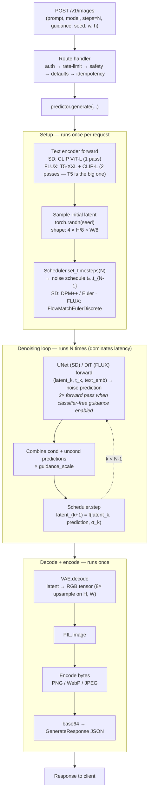

# Diffusion Serving (SD + FLUX) — Implementation Plan

Add image generation endpoints to the existing Ray Serve app at `sentimentizer/serve/app.py`,
supporting Stable Diffusion 2.1 (small, fast) and FLUX.1-dev Q8 (large, slow). Target hardware is
**GCP L4 GPUs (24 GB VRAM)**.

Risk/gap annotations are marked with **[RISK]**, **[GAP]**, or **[SAFE]**.

---

## Context

The existing serve app handles sentiment + router classification on CPU. Image generation
introduces several new concerns the current app doesn't handle:

- **GPU compute** — diffusion needs `num_gpus >= 1` per replica
- **Long inference times** — 2–25 s per request vs. ms-range sentiment (synchronous-only is
  fragile for FLUX; need async-job mode as escape hatch)
- **Expensive abuse surface** — each request consumes seconds of GPU time, so the routes need
  auth, rate limiting, idempotency, and prompt safety filtering
- **Large responses** — images are ~3 MB at 1024², vs. ~100 B for sentiment
- **Reproducibility expectations** — clients need stable IDs, echoed params, and resolved seeds

These protections apply **only to the new `/v1/images/*` routes**. Existing sentiment endpoints
remain unauthenticated to preserve backwards compatibility.

### API surface (overview)

```
POST   /v1/images                   synchronous generation (default)
GET    /v1/images/{id}              fetch image by id (P1, requires URL-mode storage)

POST   /v1/images/jobs              async generation (P1) — 201 Created + Location header
GET    /v1/images/jobs              list jobs (P1) — paginated per AIP-158
GET    /v1/images/jobs/{job_id}     async poll
DELETE /v1/images/jobs/{job_id}     cancel queued or processing job (P1)

GET    /v1/images/models            list available models
GET    /v1/images/models/{name}     single model metadata
```

Model selection is in the **request body** (`{"model": "sd" | "flux"}`), matching the existing
convention in [sentimentizer/serve/models.py:14](sentimentizer/serve/models.py#L14) for sentiment.
This means adding a new model (SDXL, FLUX-schnell) doesn't require a new route.

### Design notes

The shape is **partially resource-oriented**: collections (`/models`, `/jobs`) follow standard
ROD/AIP conventions (list, get, create, delete, paginated); the sync `POST /v1/images` endpoint
returns the image inline rather than redirecting to a separately-`GET`able resource, matching
OpenAI/Stability/Replicate convention and avoiding a round-trip on the hot path for fast SD.
List endpoints follow [AIP-158](https://google.aip.dev/158) pagination
(`page_size` + `page_token` + `next_page_token`). The `id` returned by sync `POST /v1/images`
becomes addressable via `GET /v1/images/{id}` only when URL-mode storage lands in P1.10 —
sync-only deployments don't persist images.

### Hardware sizing (L4, 24 GB)

| Model | Format | VRAM | Latency (28 steps, 1024²) |
|---|---|---|---|
| SD 2.1 | bfloat16 | ~6 GB | ~2–3 s |
| FLUX.1-dev | Q8 GGUF + bf16 T5 | ~22 GB | ~15–25 s |

**[RISK]** FLUX-Q8 is tight on L4. Escape hatches if OOM appears in load testing:
`pipe.enable_model_cpu_offload()` to swap T5 between encode and denoise, or drop to Q6.

### What runs inside `predictor.generate()`

The diffusers pipeline is **multiple steps**, not a single forward pass. The denoising loop
dominates latency (N × UNet/DiT forward passes), and the loop's shape is what makes vLLM-style
continuous batching irrelevant (fixed N, no KV cache, every step the same cost). Step-reduction
techniques (LCM-LoRA for SD, `flux-schnell` for FLUX) attack the loop directly by shrinking N.



**Where time goes** (L4, 1024², 28 steps, CFG on):

| Stage | SD 2.1 | FLUX.1-dev Q8 |
|---|---|---|
| Text encode | ~50 ms (CLIP-L) | ~500 ms (T5-XXL is big) |
| Denoising loop (28 × UNet/DiT, ×2 for CFG) | ~1.5–2 s | ~14–22 s |
| VAE decode | ~150 ms | ~250 ms |
| Encode + b64 (PNG, 1024²) | ~50 ms | ~50 ms |
| **Total** | **~2–3 s** | **~15–25 s** |

The loop is ~85% of FLUX wall-time, which is why `torch.compile` on the DiT (item 1 below) is
the highest-ROI P0 optimization.

### Inference acceleration (what to use, what to skip)

**vLLM is not a fit here.** vLLM targets autoregressive LLM inference (PagedAttention,
continuous batching, KV-cache paging) — diffusion has no KV cache, fixed step counts, and a
UNet/DiT forward pass as the bottleneck. Adoption would add a dependency without moving
throughput. vLLM only enters the picture if a text-generation model (e.g. a prompt enhancer)
is later added as a separate deployment.

What does help on L4, in rough ROI order:

1. **`torch.compile(mode="reduce-overhead")`** on the UNet / DiT — 15–30% speedup, drop-in from
   diffusers. Call inside `predictor.warmup()` so the compile cost is paid before serving traffic.
   **P0** (cheap, no infra).
2. **SDPA / xformers attention** — diffusers enables SDPA by default in recent versions; verify
   it is active, fall back to `enable_xformers_memory_efficient_attention()` if not. **P0**.
3. **TensorRT or specialized diffusion compilers** ([Stable-Fast](https://github.com/chengzeyi/stable-fast),
   [OneDiff](https://github.com/siliconflow/onediff)) — ~2× wins, more setup cost. **P2**.
4. **Step-reduction**: LCM-LoRA or DPM-Solver++ for SD; `flux-schnell` (4-step) for FLUX if
   quality allows. **P2**.
5. **FP8 quantization** for SD via [TorchAO](https://github.com/pytorch/ao) — frees VRAM for
   higher concurrency or resolution. Already on Q8 GGUF for FLUX. **P2**.

---

## P0 — Do now

### 1. Diffusion predictor module

**Problem**: No abstraction exists for diffusion model loading + inference. Need a class that
mirrors `SentimentPredictor` so the serve layer pattern stays familiar, and so the route
dispatcher can target SD or FLUX through one interface.

**Changes**:

- `sentimentizer/diffusion/__init__.py` — new package
- `sentimentizer/diffusion/config.py`:
  - `DiffusionModelConfig` dataclass: `model_id`, `model_path`, `dtype`, `quantization`,
    plus per-model defaults: `default_steps`, `default_guidance`, `max_pixels`,
    `dim_alignment` (8 for SD, 16 for FLUX)
- `sentimentizer/diffusion/predictor.py`:
  - `DiffusionPredictor` ABC with `generate()`, `warmup()`, `model_loaded` property,
    `resolve_defaults(req) -> dict` (fills in per-model defaults for unset fields),
    `model_info() -> dict` (for `/v1/images/models/{name}`)
  - `SDPredictor(DiffusionPredictor)` — wraps `StableDiffusionPipeline.from_pretrained`;
    `default_steps=30, default_guidance=7.5`
  - `FluxPredictor(DiffusionPredictor)` — wraps `FluxPipeline.from_single_file` with
    `GGUFQuantizationConfig(compute_dtype=torch.bfloat16)` for Q8 GGUF;
    `default_steps=28, default_guidance=3.5`
  - `_encode_pil(img, format) -> bytes` and `_b64(bytes) -> str` helpers, supporting `png`,
    `webp` (quality 85), `jpeg` (quality 90)
  - `_generate_id() -> str` — returns `"img_" + base32(uuid4)[:12]` for the response `id` field
- `tests/test_diffusion_predictor.py`:
  - CPU-only smoke test using `hf-internal-testing/tiny-stable-diffusion-torch`
  - Tests lifecycle: init → warmup → generate → unload
  - Tests `resolve_defaults` per-model

**[SAFE]** Adding a new package, no existing code touched.

---

### 2. Shared safety module

**Problem**: Prompt-injection regex patterns are duplicated between the new diffusion safety
filter and the existing one in [sentimentizer/agent/websearch.py](sentimentizer/agent/websearch.py).

**Changes**:

- `sentimentizer/safety.py` — **new shared module**
  - `INJECTION_PATTERNS: list[re.Pattern]` — moved from `websearch.py`
  - `NSFW_BLOCKLIST: list[str]` — loadable from file via config (default: small starter list)
  - `is_safe(prompt: str) -> tuple[bool, str | None, str | None]` — returns
    `(safe, error_code, message)`. Error codes: `content_policy_violation`,
    `prompt_injection_detected`
- Refactor `sentimentizer/agent/websearch.py` to import from `sentimentizer.safety` instead of
  defining its own pattern list. No behavior change for web search; pure consolidation.

**[SAFE]** Refactor of existing code, covered by `tests/test_websearch.py`.

---

### 3. Middleware: auth, rate limiting, idempotency, errors

**Problem**: Image generation is expensive and idempotent-by-seed. We need auth, observable rate
limiting (with bucket-state headers, not just `Retry-After`), structured error codes,
idempotency-key support (Stripe pattern), and an audit log for key usage.

**Changes**:

- `sentimentizer/serve/middleware.py` — new module
  - `require_api_key(authorization: str = Header(...)) -> str`:
    - FastAPI dependency, validates `Bearer <key>` against `SENTIMENTIZER_API_KEYS` env var
    - Returns the key for downstream use as rate-limit + idempotency-cache identity
    - Logs first 8 chars of key (e.g. `sk_abc123…`) — **never** the full key
    - Raises 401 with `{"code": "invalid_api_key", "message": ...}` on miss
  - `RateLimiter` class — in-memory token bucket per API key (per-replica)
    - Exposes `state(key) -> RateLimitState(limit, remaining, reset_at)` for header emission
  - `rate_limit(response: Response, api_key: str = Depends(require_api_key)) -> None`:
    - Calls `_limiter.check(api_key)`; on success injects:
      - `X-RateLimit-Limit: 60`
      - `X-RateLimit-Remaining: 23`
      - `X-RateLimit-Reset: 1700000000`
    - On exceeded raises 429 + `Retry-After` header
  - `IdempotencyCache` class — in-memory `dict[key, (response_body, expires_at)]`, ~10-min TTL
  - `idempotent(request, response, api_key = Depends(require_api_key)) -> str | None`:
    - Reads `Idempotency-Key` request header (optional; up to 128 chars, alnum + `-` + `_`)
    - Returns cached response if hit; otherwise returns the key for the handler to store under
    - Scoped per-API-key (cache key = `(api_key, idempotency_key)`) so two tenants can't collide
    - **[RISK]** Per-replica cache → a request retried against a different replica won't hit.
      Acceptable for v1; swap to Redis if needed.
  - `check_prompt_safety(prompt: str) -> None`:
    - Calls `sentimentizer.safety.is_safe()`
    - Raises `HTTPException(400, detail={"code": code, "message": msg})` on policy hit
    - Used inside the route body, not as a dependency, because it inspects the payload

- `sentimentizer/serve/app.py` — extend error code mapping:
  - `_status_code_to_error_code()` ([app.py:213](sentimentizer/serve/app.py#L213)) currently maps
    a fixed set. Extend so handlers can raise `HTTPException(detail={"code": ..., "message": ...})`
    and the existing `http_exception_handler` will pass it through unchanged (it already does for
    dict-shaped detail — verify and document).
  - New domain error codes used by diffusion routes:
    - `invalid_api_key` (401)
    - `forbidden` (403) — calling key doesn't own the requested resource (jobs, images)
    - `content_policy_violation` (400)
    - `prompt_injection_detected` (400)
    - `invalid_dimensions` (400) — width × height exceeds per-model `max_pixels`
    - `prompt_too_long` (400)
    - `model_not_loaded` (503)
    - `model_unavailable` (400) — requested model is not enabled in config
    - `rate_limit_exceeded` (429)
    - `idempotency_key_conflict` (409) — same key with different request body
    - `job_not_found` (404) — async job id unknown or expired (P1.9)
    - `image_expired` (404) — GET /v1/images/{id} after lifecycle TTL (P1.10)

- `tests/test_middleware.py`:
  - Auth: 401 on missing/invalid bearer, 200 on valid key, key prefix appears in logs
  - Rate limit: 429 after N+1, headers present on every response (success and failure)
  - Idempotency: second identical request returns cached body; mismatched body returns 409
  - Safety filter: 400 on blocklist hit and injection pattern, both with structured `code` field
  - Error envelope: each new code surfaces through `http_exception_handler` correctly

**[RISK]** Per-replica idempotency + rate-limit state means scaling out weakens both guarantees.
Cluster-wide enforcement (Redis) is P2.

**[SAFE]** Middleware is scoped via per-route `dependencies=[...]` on the diffusion routes only.
Existing sentiment routes are untouched.

---

### 4. Image API surface — request/response models

**Problem**: Need Pydantic models that follow industry conventions (OpenAI Images, Stability AI),
support per-model defaults, and are forward-compatible with async jobs and URL responses.

**Changes**:

- `sentimentizer/serve/diffusion_models.py` — new module

```python
class GenerateRequest(BaseModel):
    prompt: str = Field(..., min_length=1, max_length=2000)
    model: str | None = Field(None, description="sd | flux; default: cfg.default_image_model")
    negative_prompt: str | None = Field(None, max_length=2000)
    steps: int | None = Field(None, ge=1, le=100, description="default depends on model")
    guidance_scale: float | None = Field(None, ge=0.0, le=20.0)
    width: int = Field(1024, ge=256, le=2048, multiple_of=8,
        description="loosest constraint (8) enforced at schema level. Per-model alignment "
                    "(FLUX needs multiple_of=16 in some configs) is enforced post-resolve "
                    "inside the route — see invalid_dimensions error code.")
    height: int = Field(1024, ge=256, le=2048, multiple_of=8, description="see width")
    seed: int | None = None
    response_format: Literal["b64_json", "url"] = "b64_json"  # url is P1
    output_format: Literal["png", "webp", "jpeg"] = "png"
    user: str | None = Field(None, max_length=128, description="opaque end-user id for abuse tracking")

    model_config = {
        "json_schema_extra": {
            "examples": [
                {
                    "prompt": "a red apple on a wooden table",
                    "model": "sd",
                    "width": 1024,
                    "height": 1024,
                    "output_format": "png",
                },
                {
                    "prompt": "a cinematic portrait of an astronaut",
                    "negative_prompt": "blurry, low quality",
                    "model": "flux",
                    "steps": 28,
                    "guidance_scale": 3.5,
                    "width": 1024,
                    "height": 1024,
                    "seed": 42,
                    "response_format": "b64_json",
                    "output_format": "webp",
                },
            ]
        }
    }

    @model_validator(mode="after")
    def _check_pixel_budget(self) -> "GenerateRequest":
        # Per-model max_pixels AND per-model dimension alignment (FLUX 16 vs SD 8) are
        # enforced inside the route after model is resolved, because limits differ between
        # SD and FLUX. This validator only checks the cross-field invariant width*height > 0.
        ...

class GenerateResponse(BaseModel):
    id: str                  # "img_" + 12 chars, stable across the response lifecycle
    created: int             # unix timestamp
    model: str               # resolved model name
    image_b64: str | None    # populated iff response_format=b64_json
    image_url: str | None    # populated iff response_format=url (P1)
    format: str              # png | webp | jpeg
    width: int               # echoed
    height: int              # echoed
    seed: int                # resolved (always populated, even if input was None)
    steps: int               # resolved
    guidance_scale: float    # resolved
    negative_prompt: str | None  # echoed
    latency_s: float

# Discovery
class ImageModelInfo(BaseModel):
    name: str
    status: Literal["loaded", "not_loaded", "error"]
    error: str | None = None
    max_width: int
    max_height: int
    max_pixels: int
    default_steps: int
    default_guidance: float
    quantization: str | None  # e.g. "Q8_0" for FLUX

class ImageModelsResponse(BaseModel):
    models: dict[str, ImageModelInfo]
    default: str

class ImageModelDetailResponse(BaseModel):
    model: str
    info: ImageModelInfo
```

All models follow the existing `model_config = {"json_schema_extra": {"examples": [...]}}`
pattern from [sentimentizer/serve/models.py](sentimentizer/serve/models.py) so Swagger docs are
rich.

---

### 5. Synchronous generation endpoint

**Problem**: A single `/v1/images` endpoint must dispatch to either SDDeployment or FluxDeployment
based on the request body, handle defaults resolution, enforce per-model memory limits, and emit
all the headers from middleware.

**Changes**:

- `sentimentizer/serve/diffusion_app.py` — new module (handlers attached to the same `app` from
  `sentimentizer/serve/app.py` via Ray Serve composition; see Phase 8 wiring below)

```python
@app.post(
    "/v1/images",
    response_model=GenerateResponse,
    dependencies=[Depends(require_api_key), Depends(rate_limit)],
)
async def generate_image(
    self,
    body: GenerateRequest,
    request: Request,
    idempotency_key: str | None = Depends(idempotent),
) -> dict:
    # 1. Resolve model
    model_name = body.model or self.cfg.default_image_model
    predictor = self._get_predictor(model_name)  # raises 400 model_unavailable
    if not predictor.model_loaded:
        raise HTTPException(503, detail={"code": "model_not_loaded", ...})

    # 2. Resolve per-model defaults + enforce pixel budget + per-model alignment
    resolved = predictor.resolve_defaults(body)   # fills steps, guidance, seed
    if resolved.width * resolved.height > predictor.cfg.max_pixels:
        raise HTTPException(400, detail={"code": "invalid_dimensions", ...})
    if resolved.width % predictor.cfg.dim_alignment or resolved.height % predictor.cfg.dim_alignment:
        raise HTTPException(400, detail={"code": "invalid_dimensions",
            "message": f"{model_name} requires dimensions aligned to "
                       f"{predictor.cfg.dim_alignment}px"})

    # 3. Safety
    check_prompt_safety(resolved.prompt)

    # 4. Idempotency: return cached if hit
    if idempotency_key and (cached := self._idem.get(api_key, idempotency_key)):
        return cached

    # 5. Generate — pass only inference-relevant kwargs explicitly. Do NOT splat
    # resolved.model_dump(); it would leak response_format, output_format, user,
    # idempotency, etc. into the predictor signature.
    start = time.perf_counter()
    image, used_seed = await asyncio.to_thread(
        predictor.generate,
        prompt=resolved.prompt,
        negative_prompt=resolved.negative_prompt,
        steps=resolved.steps,
        guidance_scale=resolved.guidance_scale,
        width=resolved.width,
        height=resolved.height,
        seed=resolved.seed,
    )
    latency = time.perf_counter() - start

    # 6. Encode (respect output_format)
    img_bytes = _encode_pil(image, format=resolved.output_format)
    image_b64 = _b64(img_bytes) if resolved.response_format == "b64_json" else None
    image_url = None  # P1: upload to GCS, return signed URL

    # 7. Response with all resolved params echoed
    response = {
        "id": _generate_id(),
        "created": int(time.time()),
        "model": model_name,
        "image_b64": image_b64,
        "image_url": image_url,
        "format": resolved.output_format,
        "width": resolved.width,
        "height": resolved.height,
        "seed": used_seed,
        "steps": resolved.steps,
        "guidance_scale": resolved.guidance_scale,
        "negative_prompt": resolved.negative_prompt,
        "latency_s": round(latency, 4),
    }

    # 8. Cache for idempotency
    if idempotency_key:
        self._idem.put(api_key, idempotency_key, response)

    # 9. Metrics + audit log (includes body.user if present, key prefix, id)
    self._metrics[model_name].record_request(latency)
    logger.info("image generated", id=response["id"], model=model_name,
                user=body.user, key_prefix=api_key[:8], latency_s=latency)

    return response
```

- `sentimentizer/serve/app.py` — adjustments:
  - Bump `MAX_REQUEST_BODY_BYTES` ([app.py:109](sentimentizer/serve/app.py#L109)) from
    `1 * 1024 * 1024` to `4 * 1024 * 1024` (prompts + negative_prompts + idempotency keys can
    push past 1 MB only in pathological cases, but headroom is cheap and base64 is asymmetric)
  - In `main()` ([app.py:524](sentimentizer/serve/app.py#L524)): set
    `http_options.request_timeout_s=180` so sync FLUX requests don't get killed
  - **Do not** wrap diffusion handlers in `serve.batch` — inference too slow to benefit

**[SAFE]** Reuses existing `ServiceMetrics`, exception handlers, request-ID middleware.

---

### 6. SD + FLUX deployments

**Problem**: SD and FLUX need separate Ray Serve deployments because their
`max_ongoing_requests`, GPU memory, and warmup costs differ significantly. But they must present
as a single API surface (`/v1/images`), so the dispatcher in §5 needs handles to both.

**Changes**:

- `sentimentizer/serve/diffusion_app.py`:

```python
@serve.deployment(
    num_replicas=1,
    max_ongoing_requests=4,
    ray_actor_options={"num_cpus": 2, "num_gpus": 1},
)
class SDDeployment:
    def __init__(self) -> None:
        self.predictor = SDPredictor(cfg.sd_model)
        self.predictor.warmup()
        self._metrics = ServiceMetrics(prefix="sd")

    async def generate(self, **kwargs) -> tuple[PIL.Image.Image, int]: ...
    def info(self) -> ImageModelInfo: ...

@serve.deployment(
    num_replicas=1,
    max_ongoing_requests=2,
    ray_actor_options={"num_cpus": 4, "num_gpus": 1},
)
class FluxDeployment:
    def __init__(self) -> None:
        self.predictor = FluxPredictor(cfg.flux_model)
        self.predictor.warmup()
        self._metrics = ServiceMetrics(prefix="flux")

    async def generate(self, **kwargs) -> tuple[PIL.Image.Image, int]: ...
    def info(self) -> ImageModelInfo: ...

@serve.deployment(
    num_replicas=2,
    max_ongoing_requests=20,
    ray_actor_options={"num_cpus": 1, "num_gpus": 0},
)
@serve.ingress(app)
class ImagesDispatcher:
    """Front-door deployment with HTTP routes; forwards work to SD/FLUX actors."""

    def __init__(self, sd: DeploymentHandle | None, flux: DeploymentHandle | None) -> None:
        self._handles = {}
        if sd:
            self._handles["sd"] = sd
        if flux:
            self._handles["flux"] = flux
        self._idem = IdempotencyCache(ttl_s=600)

    def _get_handle(self, model: str) -> DeploymentHandle:
        if model not in self._handles:
            raise HTTPException(400, detail={"code": "model_unavailable", ...})
        return self._handles[model]

    # ... routes from §5 attached here
```

The dispatcher pattern is the canonical Ray Serve composition pattern: a lightweight router
deployment with no GPU, holding `DeploymentHandle`s to the GPU-backed model deployments.

**[GAP]** Where do the Q8 GGUF weights live? Options:
  1. Pull from HF at container startup — slow first boot (~12 GB download)
  2. Bake into container image — large image (~15 GB)
  3. Mount from GCS via CSI driver — **preferred for L4 pods on GKE**

This decision blocks production deployment but not implementation. Code reads from
`cfg.flux_model_path`, which is path-agnostic.

---

### 7. Discovery endpoints

**Problem**: Clients need to discover what models exist, their capabilities, and which is the
default. Mirrors the existing pattern at `/v1/models` and `/v1/models/{name}` from sentiment.

**Changes**:

- `sentimentizer/serve/diffusion_app.py`:

```python
@app.get("/v1/images/models", response_model=ImageModelsResponse)
async def images_models(self) -> dict:
    return {
        "models": {name: await h.info.remote() for name, h in self._handles.items()},
        "default": self.cfg.default_image_model,
    }

@app.get("/v1/images/models/{name}", response_model=ImageModelDetailResponse)
async def images_model_detail(self, name: str = Path(...)) -> dict:
    if name not in self._handles:
        raise HTTPException(400, detail={"code": "model_unavailable", ...})
    return {"model": name, "info": await self._handles[name].info.remote()}
```

- `sentimentizer/serve/app.py`:
  - Extend `/health/ready` ([app.py:499](sentimentizer/serve/app.py#L499)) to surface diffusion
    model state under a new `image_models: dict[str, str]` field, populated only if any
    diffusion deployment is enabled. Backwards-compatible (new optional field).

---

### 8. Config extensions + wiring

**Changes**:

- `sentimentizer/serve/config.py` — add to `ServeConfig`:
  ```python
  # Diffusion
  sd_enabled: bool = False
  sd_model_id: str = "stabilityai/stable-diffusion-2-1"
  flux_enabled: bool = False
  flux_model_path: str = ""
  default_image_model: str = "sd"
  request_timeout_s: int = 180

  # Middleware
  api_keys: list[str] = field(default_factory=list)
  rate_limit_per_min: int = 60
  rate_limit_burst: int = 10
  idempotency_ttl_s: int = 600
  prompt_blocklist_path: str = ""
  ```
- Wire env vars into `_FIELD_TYPES` and `_ENV_OVERRIDES`:
  - `SENTIMENTIZER_API_KEYS` (comma-split list)
  - `SENTIMENTIZER_SD_ENABLED`, `SENTIMENTIZER_FLUX_ENABLED`
  - `SENTIMENTIZER_FLUX_MODEL_PATH`, `SENTIMENTIZER_DEFAULT_IMAGE_MODEL`
  - `SENTIMENTIZER_RATE_LIMIT_PER_MIN`, `SENTIMENTIZER_RATE_LIMIT_BURST`
  - `SENTIMENTIZER_IDEMPOTENCY_TTL_S`
- `.env.example` — document new env vars without committing real keys
- `sentimentizer/serve/serve_config.yaml` — add diffusion defaults gated off
- `sentimentizer/serve/__init__.py` / `main()`:
  ```python
  sd_handle = SDDeployment.bind() if cfg.sd_enabled else None
  flux_handle = FluxDeployment.bind() if cfg.flux_enabled else None

  deployments = {"sentimentizer": SentimentizerDeployment.bind()}
  if sd_handle or flux_handle:
      deployments["images"] = ImagesDispatcher.bind(sd_handle, flux_handle)
  serve.run(deployments)
  ```

**[SAFE]** Default `uv run` behavior unchanged — flags default off.

---

## P1 — Do after P0 lands

### 9. Async job mode for FLUX

**Problem**: 25-second sync HTTP requests are fragile against ingress timeouts (often 30–60 s),
mobile clients, and replica restarts. Async jobs decouple submission from result retrieval and
expose the queue as a first-class resource (list, get, cancel) following standard
[AIP-151](https://google.aip.dev/151) long-running-operations conventions.

**Changes**:

- `sentimentizer/serve/diffusion_models.py` — add models:
  ```python
  class JobResponse(BaseModel):
      job_id: str                  # "job_" + 16 chars
      status: Literal["queued", "processing", "succeeded", "failed", "canceled"]
      created: int
      updated: int                 # last-state-change unix ts
      model: str                   # echoed from request
      user: str | None             # echoed from request
      result: GenerateResponse | None = None
      error: dict[str, str] | None = None  # {"code": ..., "message": ...}

  class JobListResponse(BaseModel):
      jobs: list[JobResponse]
      next_page_token: str | None = None  # AIP-158: empty/missing on last page
  ```

- `sentimentizer/serve/diffusion_app.py` — four endpoints, all gated behind auth + rate-limit:

  **a. `POST /v1/images/jobs`** — create job
  - Body: same `GenerateRequest` as sync endpoint
  - Returns `201 Created` (not 202; the job resource exists immediately) with:
    - Header `Location: /v1/images/jobs/{job_id}`
    - Body `JobResponse(status="queued")`
  - Fires `handle.generate.remote(...)` which returns an `ObjectRef` immediately. The ObjectRef
    is stored in `JobStore` keyed by `job_id`. No background task; Ray Serve's internal queue
    handles work distribution, and job status is derived lazily from `ObjectRef` state on each
    GET (see "Job status is derived from `ObjectRef`" below).
  - Supports `Idempotency-Key` — second submission with same key returns the existing job's
    response, not a new job.

  **b. `GET /v1/images/jobs/{job_id}`** — read job
  - Returns current `JobResponse` (200) or 404 with `code: "job_not_found"` if expired/unknown.
  - Scoped per API key: a key can only see jobs it created (key prefix stored in job record).

  **c. `GET /v1/images/jobs`** — list jobs ([AIP-158](https://google.aip.dev/158) pagination)
  - Query params:
    - `page_size: int = Field(20, ge=1, le=100)` — capped server-side
    - `page_token: str | None` — opaque cursor
    - `status: Literal[...] | None` — optional filter
    - `model: Literal["sd", "flux"] | None` — optional filter
  - Returns `JobListResponse` with `next_page_token` populated iff more results exist.
  - Scoped per API key — never lists other tenants' jobs.

  **d. `DELETE /v1/images/jobs/{job_id}`** — cancel job
  - **API contract: cancellation is best-effort for jobs in `processing` state.** The DELETE
    returns immediately with `status="canceled"`, but the GPU may keep working until the
    in-flight diffusers call returns (see below). The client stops paying attention to the
    result; the replica does not free up instantly. Document this in the OpenAPI description.
  - Calls `ray.cancel(object_ref, force=False)` on the stored ObjectRef. Ray's behavior:
    - If the task is still queued in Ray Serve's internal queue → dequeued; never runs.
    - If the task is already executing → graceful interrupt is requested. Diffusers doesn't
      check for interruption between denoise steps, so the current step completes; once it
      returns, Ray drops the result and frees the replica for the next request. Effectively:
      the user stops paying for the result, but the GPU keeps going until the call returns.
    - **[GAP]** True mid-inference abort (kill the FLUX forward pass after step N of 28)
      requires a diffusers step-callback that raises on a cancel flag. Defer to P2.
  - Sets `canceled=True` flag on the JobRecord; subsequent GETs short-circuit to
    `status="canceled"` without consulting the ObjectRef (avoids returning a result for a
    canceled job if it landed in the race window).
  - If `status` is terminal (`succeeded`/`failed`/`canceled`): returns 200 (idempotent no-op).
  - `DELETE` of a missing job returns 404.

- **Job store as a Ray named detached actor** — cluster-wide singleton, addressable from any
  dispatcher replica. This is the
  [officially recommended Ray pattern](https://docs.ray.io/en/latest/ray-core/patterns/global-variables.html)
  for cross-replica shared mutable state ("encapsulate the global variables in an actor and pass
  the actor handle to other tasks and actors"). Plasma is **not** an option here — Ray's
  [serialization docs](https://docs.ray.io/en/latest/ray-core/objects/serialization.html) make
  clear that all plasma objects are immutable by design, which rules them out for job records
  that mutate through `queued → processing → succeeded`.

  **Job status is derived from `ObjectRef`** — not tracked via a background task. The ObjectRef
  is the source of truth for whether the work is queued, running, succeeded, or failed; we just
  index `job_id → ObjectRef + metadata`. This removes a class of race conditions and survives
  dispatcher restarts cleanly (any replica can compute status from the same ObjectRef).

  ```python
  # sentimentizer/diffusion/job_store.py
  from dataclasses import dataclass, field
  import ray, secrets, time

  @dataclass
  class JobRecord:
      job_id: str
      ref: ray.ObjectRef        # the future for the generate.remote() call
      api_key_prefix: str       # first 8 chars, for per-key scoping
      created: int              # unix ts
      model: str                # echoed
      user: str | None          # echoed (for abuse tracking)
      canceled: bool = False    # set by cancel(); short-circuits status derivation
      terminal_at: int | None = None   # unix ts when status first observed terminal (for TTL)
      terminal_status: "JobResponse | None" = None  # cached terminal response; once set,
                                                    # skip ray.wait/ray.get on every poll.
                                                    # Critical for list-endpoint perf: a 100-item
                                                    # page would otherwise issue 100 ray.wait calls.

  @ray.remote(num_cpus=0.1)
  class JobStore:
      """Thin index over Ray ObjectRefs — derives job status on read."""

      def __init__(self, ttl_s: int = 3600) -> None:
          self._jobs: dict[str, JobRecord] = {}
          self._by_key: dict[str, list[str]] = {}     # key_prefix -> [job_id, ...]
          self._ttl_s = ttl_s

      def submit(self, req, api_key, ref: ray.ObjectRef) -> str:
          job_id = f"job_{secrets.token_urlsafe(12)}"
          rec = JobRecord(
              job_id=job_id, ref=ref, api_key_prefix=api_key[:8],
              created=int(time.time()), model=req.model, user=req.user,
          )
          self._jobs[job_id] = rec
          self._by_key.setdefault(rec.api_key_prefix, []).append(job_id)
          return job_id

      def get(self, job_id: str, api_key: str) -> JobResponse | None:
          rec = self._jobs.get(job_id)
          if not rec or rec.api_key_prefix != api_key[:8]:
              return None
          return self._derive_status(rec)

      def _derive_status(self, rec: JobRecord) -> JobResponse:
          # 0. Cached terminal response — skip ray.wait()/ray.get() entirely.
          #    Once a job is terminal it stays terminal; no reason to keep paying for GCS RPCs.
          if rec.terminal_status is not None:
              return rec.terminal_status
          # 1. Short-circuit if cancellation was requested
          if rec.canceled:
              rec.terminal_status = JobResponse(status="canceled", ...)
              rec.terminal_at = rec.terminal_at or int(time.time())
              return rec.terminal_status
          # 2. Check ObjectRef readiness without blocking
          ready, _ = ray.wait([rec.ref], timeout=0)
          if not ready:
              return JobResponse(status="processing", ...)   # not cached; still in flight
          # 3. Terminal — extract result or error, then cache for future polls
          try:
              result = ray.get(rec.ref)
              rec.terminal_at = rec.terminal_at or int(time.time())
              rec.terminal_status = JobResponse(status="succeeded", result=result, ...)
              return rec.terminal_status
          except Exception as e:
              rec.terminal_at = rec.terminal_at or int(time.time())
              rec.terminal_status = JobResponse(
                  status="failed", error={"code": "...", "message": str(e)}
              )
              return rec.terminal_status

      def cancel(self, job_id: str, api_key: str) -> JobResponse | None:
          rec = self._jobs.get(job_id)
          if not rec or rec.api_key_prefix != api_key[:8]:
              return None
          if not rec.canceled:
              rec.canceled = True
              ray.cancel(rec.ref, force=False)
          return self._derive_status(rec)

      def list(self, api_key, page_token, page_size, **filters): ...
      def reap_expired(self) -> int:
          # remove records where terminal_at + ttl_s < now
          ...
  ```

  Note: there's no `update()` method. State changes happen in Ray (the worker fulfilling the
  ObjectRef); the JobStore is a read-side index, not a state machine we mutate from outside.

  **Bootstrap once** in `sentimentizer/serve/__init__.py / main()`, before `serve.run(...)`:
  ```python
  # Idempotent: get_if_exists=True won't recreate if already running (e.g. on dispatcher restart)
  JobStore.options(
      name="diffusion_job_store",
      lifetime="detached",
      get_if_exists=True,
  ).remote(ttl_s=cfg.job_ttl_s)
  ```

  **Access from any dispatcher replica** via name:
  ```python
  class ImagesDispatcher:
      def __init__(self, sd, flux) -> None:
          self._store = ray.get_actor("diffusion_job_store")
          ...

      async def create_job(self, body, api_key):
          # Fire the work; ObjectRef returns immediately. Ray Serve's internal queue
          # handles backpressure when FluxDeployment hits max_ongoing_requests.
          ref = self._handles[body.model].generate.remote(**body.dict())
          # Hand the ref to the JobStore for indexing. No background task needed —
          # status is derived from the ref on each subsequent GET.
          job_id = await self._store.submit.remote(body, api_key, ref)
          return await self._store.get.remote(job_id, api_key)  # returns initial JobResponse
  ```

  **Namespace note**: lookup by name is namespace-scoped. The project already calls
  `ray.init(namespace="sentimentizer", ...)` in [sentimentizer/serve/app.py:544](sentimentizer/serve/app.py#L544),
  so `ray.get_actor("diffusion_job_store")` resolves without an explicit `namespace=` kwarg.

  **Teardown**: detached actors are
  [not auto-GC'd](https://docs.ray.io/en/latest/ray-core/actors/named-actors.html) — they survive
  `serve.shutdown()`. The cluster-shutdown path at
  [sentimentizer/serve/app.py:558](sentimentizer/serve/app.py#L558) calls `ray.shutdown()`, which
  destroys the cluster and reaps detached actors automatically — no explicit `ray.kill()` needed
  for the normal path. Tests that don't tear down the full cluster must call
  `ray.kill(ray.get_actor("diffusion_job_store"))` to avoid leaking actors between test cases.

- **[SAFE]** **Dispatcher-restart correctness is automatic** with the ObjectRef-derived
  approach. If the dispatcher replica that submitted job X dies before X completes, any other
  dispatcher replica (or the same one after restart) can still answer `GET /v1/images/jobs/X`
  correctly — the ObjectRef lives in Ray's GCS and `ray.wait([ref], timeout=0)` returns the
  current status regardless of which process is asking. Contrast with a background-task design,
  where the bg task on the dead replica is lost and the job would appear stuck "processing"
  until TTL.

- **[GAP]** **Cluster-wide durability**: detached actor in-memory state is lost in two cases the
  docs call out explicitly: (a) actor restart after node failure
  ([fault tolerance docs](https://docs.ray.io/en/latest/ray-core/fault_tolerance/actors.html):
  "When an actor is restarted, its state will be recreated by rerunning its constructor"), and
  (b) full cluster destroy ("Detached actors... are cleaned up when the Ray cluster is
  destroyed"). For v1 this is acceptable: the 1-hour TTL means most affected jobs would expire
  soon anyway, and in-flight GPU work is also lost when an actor's node dies, so the recovery
  story is symmetric — clients retry. If durability becomes a requirement, P2 work adds the
  documented self-managed checkpoint pattern: the actor periodically writes `self._jobs` to GCS
  in its update path, and the constructor reads from GCS on init. GCS (not local disk) because
  the doc warns: "If the checkpoint is saved to external storage, make sure it's accessible to
  the entire cluster since the actor can be restarted on a different node."

- **[SAFE]** Sync `POST /v1/images` continues to work unchanged; SD callers should keep using it
  for ergonomics. FLUX callers are encouraged to use the async API.

- **[SAFE]** No Redis or other external KV needed for v1 or steady-state — Ray's own primitives
  cover the workload. Throughput ceiling for a single-actor JobStore is ~10k ops/sec, far above
  realistic create/poll rates for image generation (a 100 RPS sustained create rate is ~1% of
  capacity).

- `tests/test_diffusion_jobs.py`:
  - Create job → 201 + `Location` header points to correct URL + body has `status="queued"`
  - Get job → polls through `queued → processing → succeeded` states
  - **Status derived from ObjectRef**: submit a slow Ray task (e.g. `time.sleep(1)` actor),
    verify GET returns `processing` before sleep ends and `succeeded` after, **without** any
    background task or external state push
  - List jobs → returns only the calling key's jobs, paginates correctly, `next_page_token`
    round-trips, filters by status/model
  - Cancel queued job → `ray.cancel` invoked, GET returns `status="canceled"`
  - Cancel processing job → `ray.cancel(force=False)` invoked, `canceled=True` flag set; GET
    returns `canceled` even if the task subsequently completes (the short-circuit honors the
    cancel flag and ignores the late-arriving result)
  - Cancel terminal job → 200 idempotent (no second `ray.cancel` call)
  - Cancel missing job → 404
  - Idempotency-Key on create returns same job_id on retry
  - Failed job → submit a Ray task that raises; GET returns `status="failed"` with `error.code`
    and `error.message` populated from the exception
  - **Cross-replica visibility**: create job via dispatcher replica A, GET via replica B returns
    correct status (validates both the named-actor pattern and ObjectRef-derived status work
    across processes; simulated via two `ImagesDispatcher` instances bound to the same
    `JobStore` actor)
  - **Dispatcher-restart correctness**: create job, simulate dispatcher restart by recreating
    the `ImagesDispatcher`, GET still returns correct status (proves ObjectRef state survives
    the dispatcher process)
  - **Actor cleanup**: `ray.kill(ray.get_actor("diffusion_job_store"))` in fixture teardown so
    test cases don't leak actor state between runs

---

### 10. URL response format + addressable image resource

**Problem**: `b64_json` responses are large and uncacheable. Production clients (web apps,
mobile, third-party integrations) want a URL they can `` and share. Once images
are persisted, the `id` returned from `POST /v1/images` becomes a real resource that should be
addressable via `GET /v1/images/{id}` — making the API meaningfully more ROD-aligned.

**Changes**:

- Add GCS upload backend: `sentimentizer/diffusion/storage.py`
  - `class ImageStorage(Protocol)`:
    - `put(id, bytes, format, api_key) -> str` (returns signed URL, tags object with key prefix
      for access control)
    - `get_metadata(id, api_key) -> ImageMetadata | None`
    - `get_signed_url(id, api_key, ttl_s) -> str | None`
  - `class GCSImageStorage` implementation using `google-cloud-storage`
  - Configurable bucket, prefix, signed-URL TTL (default 24 h)
- Wire into sync route: when `response_format="url"`, upload bytes and return URL in `image_url`.
  Object metadata stores `api_key_prefix` (first 8 chars), `model`, `created`, `user`, format,
  dimensions for later metadata retrieval.
- **New endpoint:** `GET /v1/images/{id}` — fetch image metadata + a fresh signed URL
  - Auth + rate-limit applied
  - Returns 404 if id not found, 403 if `api_key_prefix` on the object doesn't match the
    calling key (defense against id-guessing)
  - Response shape:
    ```python
    class ImageDetailResponse(BaseModel):
        id: str
        created: int
        model: str
        image_url: str         # fresh signed URL, TTL = cfg.image_url_ttl_s
        format: str
        width: int
        height: int
        user: str | None
    ```
  - Idempotent — same id always returns same metadata; URL refreshes each call.
- Config: `image_storage_bucket`, `image_storage_prefix`, `image_url_ttl_s`
- Auto-cleanup: GCS bucket lifecycle policy deletes objects after `image_storage_ttl_days` (e.g.
  30 days). `GET /v1/images/{id}` of an expired object returns 404 `code: "image_expired"`.
- **[GAP]** No `GET /v1/images` (list user's images) endpoint in this phase. Listable history is
  a meaningful UX feature but adds query/indexing complexity (GCS doesn't list-by-tag well, so
  we'd need a sidecar metadata store). Defer to P2 if there's demand.
- `tests/test_diffusion_storage.py`:
  - `response_format="url"` round-trip: POST → fetch URL → download bytes → verify equal to
    in-memory PIL image
  - `GET /v1/images/{id}` for own image → 200
  - `GET /v1/images/{id}` for another key's image → 403 `code: "forbidden"`
  - `GET /v1/images/{id}` after lifecycle expiry → 404 `code: "image_expired"`

---

### 11. GCS mount for FLUX weights

**Problem**: Pulling 12 GB from HF at every pod start is too slow for autoscaling.

**Changes**:

- `k8s/diffusion-deployment.yaml` — new manifest separate from sentiment deployment
  - Node selector: L4 GPU node pool (`cloud.google.com/gke-accelerator: nvidia-l4`)
  - CSI volume mounting GCS bucket containing FLUX weights
  - Resource request: `nvidia.com/gpu: 1`, memory: 32 Gi
- `k8s/diffusion-secret.yaml` — `SENTIMENTIZER_API_KEYS` from GCP Secret Manager via env injection

**[RISK]** L4 cold-start kernel compilation adds ~30s on first inference. Mitigated by
`warmup()` call in `__init__`. Readiness probe should not gate on warmup completion (would
extend pod-ready time to ~60s); instead `warmup()` runs synchronously in `__init__` so the
deployment is unhealthy until ready — Ray Serve handles routing around it.

---

### 12. Observability extensions

**Changes**:

- `ServiceMetrics` from `sentimentizer/serve/base.py` already provides per-prefix counters. Each
  deployment instantiates `ServiceMetrics(prefix="sd"|"flux")` for latency histograms +
  request/error counts in Prometheus exposition.
- Add structured audit log line per generation: `id`, `model`, `user`, `key_prefix`, `latency_s`,
  `prompt_hash` (sha256-truncated, never the raw prompt).
- `/v1/images/models` extended response can include per-model `requests_total`,
  `latency_p50_s`, `latency_p95_s` derived from `ServiceMetrics` snapshots.

---

## Verification

### Unit tests (CPU-only, run in CI)

```bash
uv run pytest tests/test_middleware.py tests/test_diffusion_predictor.py tests/test_diffusion_app.py -v
```

Covers:
- **Auth**: 401 missing/invalid, 200 valid, key prefix in audit log, never full key
- **Rate limit**: 429 after N+1; `X-RateLimit-{Limit,Remaining,Reset}` present on success and
  failure; `Retry-After` present on 429
- **Idempotency**: 2nd identical request with same `Idempotency-Key` returns cached body; same
  key + different body returns 409 `idempotency_key_conflict`; cache scoped per API key
- **Safety filter**: 400 with `content_policy_violation` on blocklist hit; 400 with
  `prompt_injection_detected` on injection pattern
- **Pydantic validation**: 422 on out-of-bounds dims/steps/guidance/prompt length
- **Pixel budget**: 400 with `invalid_dimensions` when width × height > model `max_pixels`
- **Defaults resolution**: SD gets steps=30/guidance=7.5, FLUX gets steps=28/guidance=3.5 when
  fields omitted
- **Response shape**: all resolved params echoed; `id` matches `img_[A-Z2-7]{12}` format;
  `created` within ±5 s of now; `seed` populated even when input was None
- **Predictor lifecycle** on tiny-SD model
- **Discovery**: `GET /v1/images/models` returns enabled models with correct status

### Integration tests (GPU-gated, auto-skip without CUDA)

```bash
SENTIMENTIZER_SD_ENABLED=1 uv run pytest tests/test_diffusion_integration.py -v
```

End-to-end: POST `/v1/images` with valid key → 200 + decodable PNG/WebP/JPEG; correct dimensions;
`steps`, `guidance_scale`, `seed` echoed.

### Manual smoke (L4 instance)

```bash
SENTIMENTIZER_API_KEYS=test-key-123 \
SENTIMENTIZER_FLUX_ENABLED=1 \
SENTIMENTIZER_FLUX_MODEL_PATH=/mnt/gcs/flux1-dev-Q8_0.gguf \
uv run python -m sentimentizer.serve

# Sync request, default model (SD)
curl -X POST http://localhost:8000/v1/images \
  -H "Authorization: Bearer test-key-123" \
  -H "Content-Type: application/json" \
  -H "Idempotency-Key: smoke-001" \
  -d '{"prompt": "a red apple on a wooden table"}' \
  -i

# Sync request, FLUX, webp output
curl -X POST http://localhost:8000/v1/images \
  -H "Authorization: Bearer test-key-123" \
  -H "Content-Type: application/json" \
  -d '{"prompt": "...", "model": "flux", "output_format": "webp", "steps": 28}' \
  | jq -r '.image_b64' | base64 -d > out.webp

# Discovery
curl http://localhost:8000/v1/images/models -H "Authorization: Bearer test-key-123" | jq

# Auth + rate-limit headers
# Look for: X-RateLimit-Limit, X-RateLimit-Remaining, X-RateLimit-Reset on every response
```

Verify:
- 401 with `{"error": {"code": "invalid_api_key", ...}}` without `Authorization` header
- 429 with `Retry-After` on 61st request within a minute (default `rate_limit_per_min=60`)
- 400 with `{"error": {"code": "prompt_injection_detected", ...}}` on injection-pattern prompt
- 400 with `{"error": {"code": "invalid_dimensions", ...}}` on 2048×2048 request to FLUX
- 2nd request with same `Idempotency-Key` returns identical body + same `id`
- FLUX steady-state latency ~15–25 s on L4; SD ~2–3 s
- `nvidia-smi` shows ~22 GB VRAM during FLUX inference

### Load smoke

```bash
hey -n 50 -c 4 -m POST \
  -H "Authorization: Bearer test-key-123" \
  -H "Content-Type: application/json" \
  -d @sd_body.json \
  http://localhost:8000/v1/images
```

Watch p95 latency, queue depth, rate-limit 429 distribution.

### Full test suite (per CLAUDE.md)

```bash
uv run pytest tests/ -v --exitfirst --failed-first
```

---

## Rollout order

1. **P0.1** Predictor + tiny-SD test — ~1 day, no infra
2. **P0.2** Shared safety module + websearch refactor — ~½ day, no infra
3. **P0.3** Middleware (auth, rate-limit headers, idempotency, errors) + tests — ~1.5 days
4. **P0.4** Request/response Pydantic models — ~½ day
5. **P0.5–7** Dispatcher + SD deployment + discovery, gated off — ~1 day, needs L4 to validate
6. **P0.6** FLUX deployment, gated off — ~1 day, needs L4 + Q8 GGUF accessible to node
7. **P0.8** Config wiring — ~½ day
8. **P1.9** Async jobs — ~1 day
9. **P1.10** URL storage backend — ~1 day
10. **P1.11** K8s manifest + GCS mount — ~1 day, infra-side
11. **P1.12** Observability extensions — ~½ day
12. Flip enable flags in prod config, monitor

---

## Open questions

1. **API key storage in prod**: env var works for local/staging; switch to GCP Secret Manager via
   env injection for production?
2. **IP-based limiter as defense-in-depth**: keys required, but should we also add a baseline
   IP-based limit in case a key leaks?
3. **Prompt blocklist source**: ship a starter list in the repo, or load externally from a
   GCS-mounted policy file at startup?
4. **Idempotency-key conflict semantics**: 409 if same key + different body (current plan), or
   silently overwrite? 409 is safer (forces the client to deal with their own bug) but stricter
   than Stripe's pattern (which uses 422).
5. **`response_format=url` retention**: 24 h signed URLs by default — long enough for sharing,
   short enough to limit storage cost. Negotiable.
