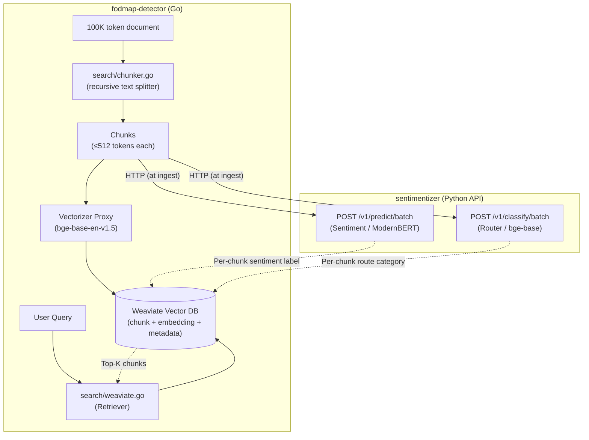

# Adding ModernBERT-base to Sentimentizer

> **Status: PLANNING (Reviewed)** — May 22, 2026

## Background

The current sentimentizer pipeline uses three architectures — RNN (BiLSTM), Transformer Encoder, and Transformer Encoder-Decoder — all built on **GloVe-300d** static embeddings with a custom regex tokenizer and gensim dictionary. These are "small" models (~2–6M parameters) that train fast but have a hard ceiling on representation quality.

Adding **ModernBERT-base** introduces a fourth `model_type` with contextual embeddings, a HuggingFace tokenizer, and dramatically higher accuracy — at the cost of larger model size, GPU memory, and slower inference.

Production documents can be up to **100K tokens** (~200 pages), requiring a **chunking + vector DB** strategy in the fodmap-detector Go backend. Sentimentizer receives pre-chunked text and classifies it.

---

## Decisions Made

- **Model**: ModernBERT-base (`answerdotai/ModernBERT-base`, 149M params)
- **Training**: Full fine-tuning with **8-bit AdamW** optimizer (via `bitsandbytes`) — same accuracy as fp32 with ~75% less optimizer memory
- **Router backbone**: **No change** — keep `BAAI/bge-base-en-v1.5` (<1 point MTEB difference vs modernbert-embed-base, no task-prefix complexity)
- **Long-context**: Chunking via pure Go custom text splitter in the backend (fodmap-detector), vector DB storage, sentimentizer classifies pre-chunked text
- **Repo**: Same repo, `transformers` already available transitively via `sentence-transformers` in `[router]`
- **ONNX (this plan)**: ModernBERT's PyTorch path is incompatible with `torch.onnx.export` (HuggingFace model format, optional Flash Attention). The current `export_onnx.py` uses `torch.onnx.export`, so the existing CLI/serving path will reject ONNX export for ModernBERT via `SUPPORTS_ONNX=False`. **This is a code-path limitation, not a fundamental one** — see follow-on item below.
- **Out of scope — ONNX via `optimum`**: HuggingFace's `optimum.exporters.onnx` (>=1.24.0) supports ModernBERT export when `attn_implementation="eager"` (already this plan's default). A working ONNX path would yield ~2–3× CPU inference speedup, but it needs: `optimum` added to extras, a separate code path in `export_onnx.py`, serving updates to optionally load `ORTModelForSequenceClassification`, and verification that the classifier head exports cleanly (or is chained at inference time). **Separate plan if latency requires it.**
- **Out of scope — alternative HF models**: This plan ships ModernBERT only. If inference latency turns out to be a blocker post-deployment, evaluating a smaller alternative (DistilBERT, MiniLM, etc.) is a **separate plan**. The `HFTransformerModel` base class makes the architecture extensible to such a follow-up, but choosing the alternative requires its own design work — MiniLM in particular is a sentence-transformer trained for similarity tasks and needs a different pooling/head than what ModernBERT uses; don't treat it as a drop-in.

---

## Architecture: Model-Owned Behavior

The existing codebase has accumulated `model_type` string dispatch in several places (`_get_opt_params`, `_get_sched_params`, `get_trained_model`, `predictor`, `tokenize` stage, etc.). Adding ModernBERT naively would add ~12 more `if model_type == "modernbert":` branches across trainer, checkpointing, Ray worker, serving, and CLI code. Any future HF model swap would then need to touch all of them.

**The plan instead pushes behavior onto the model class itself.** Each model declares its own capabilities; trainer/Ray/checkpoint code is model-agnostic and calls *into* the model. Adding a new HF model becomes a one-class subclass change.

### `BaseSentimentModel` interface

```python
from typing import ClassVar
from pathlib import Path

class BaseSentimentModel(nn.Module):
    """All models declare their capabilities via these class attrs + methods.
    Trainer code never branches on model_type strings — it reads these instead."""

    # ── Capability declarations (class-level, no dispatch) ──────────────────
    OPT_PARAMS_CLS:    ClassVar[type] = OptimizationParams
    SCHED_PARAMS_CLS:  ClassVar[type] = SchedulerParams
    NEEDS_TOKENIZE_STAGE: ClassVar[bool] = True  # GloVe needs gensim tokenize; HF models don't
    DDP_FIND_UNUSED_PARAMS: ClassVar[bool] = False  # True for HF models during freeze
    SUPPORTS_ONNX: ClassVar[bool] = True  # False for HF models — torch.onnx.export incompatible.
                                          # (HF models CAN be exported via optimum — separate plan.)

    # ── Behavior overrides (per-subclass) ───────────────────────────────────
    def prepare_batch(self, batch: dict, device: str) -> tuple[dict, torch.Tensor]:
        """Convert a raw batch dict into (model_inputs, target). Default assumes
        batch has 'input_ids' and 'target' keys. HF models override to include
        'attention_mask' and rename columns from Ray dataset format."""
        target = batch["target"].to(device)
        inputs = {k: v.to(device) for k, v in batch.items() if k != "target"}
        return inputs, target

    def save_to_checkpoint_dir(self, ckpt_dir: Path, tokenizer=None) -> dict:
        """Save model state into ckpt_dir. Return metadata dict to be merged
        into the .pth header. Default: pickle state_dict (GloVe path)."""
        return {"model_state_dict": self.state_dict()}

    @classmethod
    def load_from_checkpoint_dir(cls, ckpt_dir: Path, metadata: dict, device: str) -> "BaseSentimentModel":
        """Construct an instance and restore weights. Default: rebuild via
        new_model() + load_state_dict (GloVe path). HF subclass overrides
        to use AutoModel.from_pretrained."""
        ...

    def unfreeze_backbone(self) -> None:
        """No-op for GloVe (no backbone). HF subclass overrides — handles
        DDP unwrap internally so callers don't need to know if the model
        is DDP-wrapped."""
        pass

    def predict(self, inputs: dict[str, torch.Tensor]) -> torch.Tensor:
        """Dict-based predict — works for all subclasses. Replaces the old
        plain-tensor version that broke for any model needing attention_mask."""
        with torch.no_grad():
            self.eval()
            device = next(self.parameters()).device
            inputs = {k: v.to(device) for k, v in inputs.items()}
            return torch.softmax(self.forward(**inputs), dim=-1)
```

### `HFTransformerModel` shared base (new file)

```python
# sentimentizer/models/hf_base.py

class HFTransformerModel(BaseSentimentModel):
    """Shared base for any HuggingFace encoder. Subclasses just pick the
    pretrained model name and tune the optimization defaults."""

    HF_MODEL_NAME: ClassVar[str] = ""  # subclass provides, e.g. "answerdotai/ModernBERT-base"
    NEEDS_TOKENIZE_STAGE = False
    DDP_FIND_UNUSED_PARAMS = True  # required during freeze; cheap to leave on after
    SUPPORTS_ONNX = False

    def __init__(self, backbone, num_classes: int = 3, dropout: float = 0.1):
        super().__init__()
        self.backbone = backbone
        # Stash construction args so save_to_checkpoint_dir can persist them —
        # avoids silently loading with wrong head dims if a user trained with
        # different num_classes/dropout than the defaults.
        self._num_classes = num_classes
        self._dropout = dropout
        hidden = backbone.config.hidden_size
        self.classifier = nn.Sequential(
            nn.Dropout(dropout),
            nn.Linear(hidden, num_classes),
        )

    def forward(self, input_ids, attention_mask, **kwargs) -> torch.Tensor:
        # **kwargs absorbs token_type_ids and other HF tokenizer artifacts
        out = self.backbone(input_ids=input_ids, attention_mask=attention_mask)
        # Mean-pool over non-padding tokens. CLS-token pooling was tried for the
        # existing Encoder model and replaced with mean pooling (see AGENTS.md);
        # ModernBERT's own docs also recommend mean pooling for classification.
        mask = attention_mask.unsqueeze(-1).float()
        pooled = (out.last_hidden_state * mask).sum(dim=1) / mask.sum(dim=1).clamp(min=1)
        return self.classifier(pooled)

    def prepare_batch(self, batch, device):
        # Ray dataset stores input_ids/attention_mask under those exact keys
        # (pre-tokenized at ingest, see Phase 5). No column-name dispatch needed.
        return (
            {"input_ids": batch["input_ids"].to(device),
             "attention_mask": batch["attention_mask"].to(device)},
            batch["target"].to(device),
        )

    def save_to_checkpoint_dir(self, ckpt_dir, tokenizer=None):
        backbone_dir = ckpt_dir / "backbone"
        self.backbone.save_pretrained(backbone_dir)
        if tokenizer is not None:
            tokenizer.save_pretrained(backbone_dir)  # air-gapped K8s requirement
        return {
            "classifier_state_dict": self.classifier.state_dict(),
            "backbone_dir": "backbone",  # relative — Ray-checkpoint-safe
            "hf_model_name": self.HF_MODEL_NAME,
            # Persist head-construction args — otherwise loading with non-default
            # num_classes/dropout silently uses wrong dims and fails state_dict load
            # (or worse, succeeds with shape mismatch warnings buried in logs).
            "num_classes": self._num_classes,
            "dropout": self._dropout,
        }

    @classmethod
    def load_from_checkpoint_dir(cls, ckpt_dir, metadata, device):
        from transformers import AutoModel
        if "backbone_dir" not in metadata:
            raise ValueError(
                "Checkpoint missing 'backbone_dir' — saved with pre-refactor format. "
                "Retrain the model or use a newer checkpoint."
            )
        backbone = AutoModel.from_pretrained(
            ckpt_dir / metadata["backbone_dir"],
            attn_implementation="eager",  # Flash Attention is opt-in
        )
        model = cls(
            backbone=backbone,
            num_classes=metadata.get("num_classes", 3),
            dropout=metadata.get("dropout", 0.1),
        )
        model.classifier.load_state_dict(metadata["classifier_state_dict"])
        return model.to(device)

    def unfreeze_backbone(self):
        # Handle DDP unwrap internally — callers don't need to know
        inner = self.module if hasattr(self, "module") else self
        for p in inner.backbone.parameters():
            p.requires_grad = True
```

### Concrete subclasses — minimal

```python
# sentimentizer/models/modernbert.py
class ModernBERT(HFTransformerModel):
    MODEL_TYPE = "modernbert"  # canonical registry key — used for logging/metrics
    HF_MODEL_NAME = "answerdotai/ModernBERT-base"
    OPT_PARAMS_CLS = ModernBERTOptimizationParams   # lr=2e-5, weight_decay=0.01
    SCHED_PARAMS_CLS = ModernBERTSchedulerParams    # T_max=10, warmup_epochs=3
```

Adding a future HF model (DistilBERT, MiniLM, etc.) is a one-class subclass of `HFTransformerModel` plus a registry entry — but the actual choice of which one belongs in a separate plan.

### What this eliminates

The following dispatch sites disappear or become trivial:

| Was | Becomes |
|:---|:---|
| `_get_opt_params(model_type)` with 4 branches | `type(model).OPT_PARAMS_CLS()` |
| `_get_sched_params(model_type)` with 4 branches | `type(model).SCHED_PARAMS_CLS()` |
| `save_checkpoint(model_type=...)` dispatch | `model.save_to_checkpoint_dir(ckpt_dir, tokenizer)` |
| `load_checkpoint(model_type=...)` dispatch | `ModelClass.load_from_checkpoint_dir(ckpt_dir, metadata, device)` |
| `_iter_batches` / `_train_func` column-rename branch | `model.prepare_batch(batch, device)` |
| `prepare_model(..., find_unused_parameters=)` branch | `prepare_model(model, parallel_strategy_kwargs={"find_unused_parameters": type(model).DDP_FIND_UNUSED_PARAMS})` |
| `UnfreezeBackboneCallback` DDP unwrap branch | `model.unfreeze_backbone()` |
| `tokenize.py` modernbert guard | `if not type(model).NEEDS_TOKENIZE_STAGE: return` |
| `export_onnx.py` modernbert guard | `if not type(model).SUPPORTS_ONNX: raise NotImplementedError(...)` |
| `BaseSentimentModel.predict()` plain-tensor incompatibility | `predict()` now takes a dict — works for all subclasses |
| `get_trained_model()` weight-key introspection branch | `ModelClass.load_from_checkpoint_dir()` per-class |

### What remains as dispatch (unavoidable)

| Stays as `if model_type == ...` | Why |
|:---|:---|
| `run_train()` HF-vs-GloVe data pipeline | Pipeline runs **before** the model is constructed; the choice of pre-tokenization vs gensim tokenization is upstream |
| `workflows/driver.py` CLI arg validation | argparse runs before any model exists |
| `predictor.py` tokenizer loading (gensim vs HF) | Tokenizer is loaded before the model in `Predictor.__init__`; could be pushed to a `tokenizer_for(model_type)` factory but adds little |

Three unavoidable spots vs the original ~12 — and all three are at workflow/CLI boundaries where the model isn't instantiated yet.

---

## End-to-End Architecture



### Data Flow

1. **Ingest** (Go backend): Long document → Go text splitter → embed chunks → store in vector DB
2. **Classify** (Go → sentimentizer API): For each stored chunk, call sentimentizer to get router category + sentiment label → store as metadata
3. **Query** (Go backend): User query → Eino retriever → top-K chunks from vector DB → return pre-labeled results

---

## Model Trade-Off Analysis

### Sentiment Model Candidates

| Dimension | Existing (Encoder) | ModernBERT-base | DeBERTa-v3-base | ModernBERT-large |
|:---|:---|:---|:---|:---|
| **Parameters** | ~2.5M | ~149M | ~184M | ~395M |
| **Context length** | 200 tokens | 8,192 tokens | 512 tokens | 8,192 tokens |
| **Embedding type** | GloVe-300d (static) | Contextual (RoPE) | Contextual (disentangled) | Contextual (RoPE) |
| **Tokenizer** | Regex + gensim dict | HF WordPiece | HF SentencePiece (128K vocab) | HF WordPiece |
| **Training VRAM** | ~1 GB | ~4–6 GB (bf16) | ~8–12 GB (bf16) | ~16–24 GB (bf16) |
| **Inference latency** | ~1ms/text | ~5–10ms/text | ~8–15ms/text | ~15–30ms/text |
| **ONNX export** | ✅ via `torch.onnx.export` | ⚠️ Needs `optimum` (separate plan) | ✅ via `torch.onnx.export` | ⚠️ Needs `optimum` (separate plan) |
| **Accuracy ceiling** | Moderate | High | Very high (best sample efficiency) | Highest |
| **Flash Attention** | N/A | ✅ Supported (optional) | ❌ Not natively supported | ✅ Supported |
| **Model disk size** | ~10 MB | ~570 MB | ~700 MB | ~1.5 GB |

**Chosen: ModernBERT-base.** Best balance of accuracy, speed, context length (8K native — useful for larger chunks), and ecosystem support. DeBERTa-v3-base edges ahead on raw accuracy but has a 128K vocabulary (98M embedding params), no Flash Attention, and 512-token limit.

### Router Backbone: No Upgrade Needed

| Dimension | Current (`bge-base-en-v1.5`) | `nomic-ai/modernbert-embed-base` |
|:---|:---|:---|
| **Parameters** | 109M | ~149M |
| **Embedding dim** | 768 | 768 (Matryoshka → 256 optional) |
| **Context length** | 512 | 8,192 |
| **MTEB Classification** | 73.5 | **74.3** |
| **Requires task prefix** | No | Yes (`search_query:`, `search_document:`) |

**<1 point MTEB difference** — not worth the migration cost. The router's bottleneck is training data quality (seed examples + augmented data), not backbone embedding quality. Both produce 768-dim vectors. The task-prefix requirement (literal strings like `search_query:` prepended to text before encoding to signal what kind of embedding to produce) adds complexity to the contrastive pair pipeline for no real gain.

### 8-bit Training Strategy

| Approach | VRAM | Accuracy vs fp32 | Complexity |
|:---|:---|:---|:---|
| **Full FT + 8-bit AdamW** ✅ | **~4 GB** | **Identical** | **+1 line** (swap optimizer) |
| Full FT + fp32 AdamW | ~6 GB | Baseline | Baseline |
| LoRA (bf16 + adapters) | ~3 GB | ~0.5–1% lower | +peft library |
| QLoRA (4-bit + LoRA) | ~2 GB | 1–3% lower | +peft, +bitsandbytes, different save/load |

**8-bit AdamW** quantizes optimizer states (momentum + variance) from fp32 → int8 (8 bytes/param → 2 bytes/param). Model weights and gradients stay in bf16. Learning curves are virtually identical to fp32 AdamW — this is a drop-in replacement via `bitsandbytes.optim.AdamW8bit`. No accuracy trade-off. QLoRA/LoRA are unnecessary for ModernBERT-base (149M params) — it's small enough for full fine-tuning on a single GPU.

---

## Long-Context Strategy (100K Tokens)

### Problem

Production documents can be ~100K tokens (~200 pages). No encoder model handles this natively — ModernBERT tops out at 8K, BERT/DeBERTa at 512.

### Solution: Chunking in Go Backend

The chunking layer lives in the **fodmap-detector Go backend**. Sentimentizer receives pre-chunked text ≤512 tokens and classifies it — clean separation of concerns.

#### Chunking Algorithm

Recursive text splitting (same algorithm as LangChain's `RecursiveCharacterTextSplitter`):

```
1. Split on paragraph breaks (\n\n)
2. If any paragraph > max_tokens → split on sentence boundaries (. ! ?)
3. If any sentence > max_tokens → split on fixed token count with overlap
4. Merge adjacent small chunks up to max_tokens to avoid fragments
```

Configuration: `maxTokens=512`, `overlap=64` tokens.

#### Vector DB Storage

Each chunk is stored with pre-computed classification metadata:

```json
{
  "chunk_text": "I have celiac disease and the waiter...",
  "embedding": [0.12, -0.34, "...768-dim..."],
  "metadata": {
    "doc_id": "review_12345",
    "chunk_index": 42,
    "route_category": "dietary",
    "sentiment": "negative",
    "sentiment_score": 0.87,
    "token_count": 384
  }
}
```

Sentiment and route labels are computed at **ingest time**, not query time. Query-time latency is just vector search + metadata lookup — no model inference needed.

---

## Proposed Changes

### Phase 1: Config + Model Classes (sentimentizer)

The full code skeletons live in the "Architecture: Model-Owned Behavior" section above. This phase enumerates the file-level changes.

#### NEW: `sentimentizer/models/hf_base.py`

Defines `HFTransformerModel(BaseSentimentModel)` — the shared base for all HuggingFace encoder models. Owns all HF-specific behavior: forward pass, `prepare_batch`, `save_to_checkpoint_dir`, `load_from_checkpoint_dir`, `unfreeze_backbone`, capability flags. Subclasses only override class attrs (`HF_MODEL_NAME`, `OPT_PARAMS_CLS`, `SCHED_PARAMS_CLS`).

**Flash Attention**: `from_pretrained(attn_implementation="eager")` by default. `flash-attn` is **not** in the `[transformers]` extra — installing it requires CUDA + a custom build. The eager path is the standard for everyone; users opt in to Flash Attention manually. Benchmark numbers from "Flash Attention on" runs should be labeled as such.

#### NEW: `sentimentizer/models/modernbert.py`

```python
class ModernBERT(HFTransformerModel):
    HF_MODEL_NAME = "answerdotai/ModernBERT-base"
    OPT_PARAMS_CLS = ModernBERTOptimizationParams
    SCHED_PARAMS_CLS = ModernBERTSchedulerParams


def new_modernbert_model(model_config: ModernBERTConfig | None = None) -> ModernBERT:
    from transformers import AutoModel
    cfg = model_config or ModernBERTConfig()
    backbone = AutoModel.from_pretrained(
        ModernBERT.HF_MODEL_NAME,
        attn_implementation="eager",
    )
    return ModernBERT(backbone=backbone, num_classes=cfg.num_classes, dropout=cfg.dropout)
```

#### MODIFY: `sentimentizer/models/base.py`

- Add the new instance methods + class attrs documented in the Architecture section to `BaseSentimentModel`. GloVe defaults (`NEEDS_TOKENIZE_STAGE=True`, `OPT_PARAMS_CLS=OptimizationParams`, etc.) live here so existing RNN/Encoder/Decoder require **no changes** beyond inheriting from the updated base.
- Each existing model class gains a `MODEL_TYPE: ClassVar[str]` matching its registry key (`"rnn"`, `"encoder"`, `"decoder"`, `"modernbert"`) — used by callbacks/metrics that need the canonical string identifier (see Phase 3 callback section).
- Add `modernbert` to `_MODEL_REGISTRY`. The registry shrinks to just `{model_type: model_class, factory: callable}` — no `weights_key`, no special-case fields. `weights_key` was only used by the old `get_trained_model()` introspection which goes away entirely.
- Delete `get_trained_model()`'s weight-key introspection logic. Replace with:

  ```python
  def get_trained_model(model_type: str, device: str) -> nn.Module:
      ckpt_path = weights_path_for(model_type)
      checkpoint = torch.load(ckpt_path, map_location=device, weights_only=False)
      ModelClass = _MODEL_REGISTRY[model_type]["model_class"]
      return ModelClass.load_from_checkpoint_dir(
          ckpt_path.parent, metadata=checkpoint, device=device,
      )
  ```

  No more `embed_layer.weight` shape inference, no more `classifier.3.weight` peeking — each model class knows how to load itself.

##### `BaseSentimentModel` interface contract

To make extending the base class predictable, the Architecture section defines:

| Member | Required override? | Default behavior |
|:---|:---|:---|
| `MODEL_TYPE: ClassVar[str]` | **Yes** | Empty string — must be set per subclass |
| `OPT_PARAMS_CLS: ClassVar[type]` | **Yes** | `OptimizationParams` (probably wrong for non-GloVe) |
| `SCHED_PARAMS_CLS: ClassVar[type]` | **Yes** | `SchedulerParams` (probably wrong for non-GloVe) |
| `NEEDS_TOKENIZE_STAGE: ClassVar[bool]` | Optional | `True` (GloVe assumption) |
| `DDP_FIND_UNUSED_PARAMS: ClassVar[bool]` | Optional | `False` |
| `SUPPORTS_ONNX: ClassVar[bool]` | Optional | `True` |
| `forward(input_ids, ...)` | **Yes** | Abstract |
| `prepare_batch(batch, device)` | Optional | Default handles `{input_ids, target}` |
| `save_to_checkpoint_dir(ckpt_dir, tokenizer)` | Optional | Default pickles `state_dict()` |
| `load_from_checkpoint_dir(ckpt_dir, metadata, device)` | Optional | Default rebuilds via `new_model()` + `load_state_dict` |
| `unfreeze_backbone()` | Optional | No-op (no backbone for GloVe) |
| `predict(inputs: dict)` | Optional | Calls `forward(**inputs)` then softmax |

#### MODIFY: `sentimentizer/config.py`

- Add `ModernBERTConfig` dataclass (`model_name`, `dropout`, `num_classes`, `max_seq_length`, `freeze_backbone_epochs`)
- Add `ModernBERTOptimizationParams(OptimizationParams)` — `lr=2e-5`, `weight_decay=0.01`
- Add `ModernBERTSchedulerParams` — linear warmup + cosine decay, `T_max=10`, `warmup_epochs=3`
- Add `hf_weights_dir` to `FileConfig` — generic directory path for HF checkpoints (named generically so a future HF model can reuse it without renaming)
- Add `modernbert` to `DriverConfig`
- Update `weights_path_for()`, `default_epochs()`, `validate_config_consistency()`
- `default_epochs("modernbert")` → 8 (matches `T_max=10 ≥ epochs` invariant)

---

### Phase 2: Data Pipeline (sentimentizer)

**All datasets and loaders yield dict-based batches.** This unifies the input interface so the training loop always unpacks `(inputs_dict, target)` and calls `model(**inputs)` — no model-type dispatch at the data level.

#### MODIFY: `sentimentizer/loader.py` — dict-based `CorpusDataset`

**Change `CorpusDataset.__getitem__`** to return a dict instead of a tuple:

```python
# Before (tuple):
def __getitem__(self, idx):
    return self.data[idx], self.target[idx]

# After (dict):
def __getitem__(self, idx):
    return {
        "input_ids": self.data[idx],       # GloVe: token IDs; ModernBERT: unused (HF tokenizer handles it)
        "target": self.target[idx],
    }
```

This is the **single source of truth** for the batch format. All downstream code (DataLoader, `_iter_batches()`, training loop) unpacks dicts.

**Add `load_train_val_hf_datasets()`** for HF-tokenized data — returns `HFDataset` instances that yield `{"input_ids": ..., "attention_mask": ..., "target": ...}`.

**`_balance_dataframe()` verification**: `_balance_dataframe()` only uses the `target` column (not `data`), so it works unchanged for both GloVe (token ID arrays) and HF (raw text) datasets.

#### NEW: `sentimentizer/hf_tokenizer.py`

Thin wrapper around `AutoTokenizer`:

- Produces `{"input_ids": tensor, "attention_mask": tensor, "target": tensor}` batch structures
- Uses `padding="longest"` with `max_length=512` cap — Yelp reviews average ~50 tokens; padding to 512 wastes compute and memory. `padding="longest"` pads to the longest sequence in the batch, capped at `max_length`.
- `truncation=True, max_length=512` — explicitly truncate sequences longer than 512 tokens
- Reuses `vectorized_convert_ratings()` for label conversion
- Supports both pandas and Ray data sources

#### NEW: `sentimentizer/hf_dataset.py`

PyTorch Dataset returning dictionary of inputs: `{"input_ids": ..., "attention_mask": ..., "target": ...}`.

- `collate_hf_batch()` function — custom collate fn that pads `input_ids` and `attention_mask` to the longest sequence in the batch (using HF `tokenizer.pad()`), and stacks `target` as a regular tensor. Used by `DataLoader(collate_fn=collate_hf_batch)`.

#### MODIFY: `sentimentizer/models/rnn.py`, `encoder.py`, `decoder.py` — accept `input_ids` kwarg

**Rename the `forward()` first parameter** from `inputs` to `input_ids` and add `**kwargs` to absorb unused keys (e.g., `attention_mask` from dict-based batches):

```python
# Before:
def forward(self, inputs: torch.Tensor) -> torch.Tensor:

# After:
def forward(self, input_ids: torch.Tensor, **kwargs) -> torch.Tensor:
```

This is a **mechanical rename** — no logic changes. The `**kwargs` silently absorbs `attention_mask` and any other dict keys that GloVe models don't use. All existing call sites that pass positional args (`model(data)`) still work because `input_ids` is the first positional parameter.

---

### Phase 3: Training Pipeline (sentimentizer)

All datasets now yield dict-based batches (Phase 2), so the training loop uses a **unified interface**: every step unpacks `(inputs_dict, target)` and calls `model(**inputs_dict)`. No model-type dispatch at the training level.

#### Design: Unified Dict-Based Training

| Model type | Dataset yields | `forward()` receives | `forward()` uses |
|:---|:---|:---|:---|
| rnn, encoder, decoder | `{"input_ids": tensor, "target": tensor}` | `input_ids`, `**kwargs` (absorbs `attention_mask`) | `input_ids` only |
| modernbert | `{"input_ids": tensor, "attention_mask": tensor, "target": tensor}` | `input_ids`, `attention_mask`, `**kwargs` | Both `input_ids` + `attention_mask` |

The `**kwargs` in GloVe model `forward()` signatures (added in Phase 2) silently absorbs any extra dict keys. No dispatch needed — `model(**inputs_dict)` works for all model types.

#### MODIFY: `sentimentizer/trainer.py`

1. **`train_step()` — update to accept dict inputs**:

```python
def train_step(
    model: torch.nn.Module,
    inputs: dict[str, torch.Tensor],
    target: torch.Tensor,
    optimizer: torch.optim.Optimizer,
    loss_function: Callable,
    max_grad_norm: float = 1.0,
    use_amp: bool = False,
    grad_accum_steps: int = 1,
    accum_step_idx: int = 0,
    is_last_batch: bool = False,
    device_type: str = "cuda",
) -> float:
    # Gradient accumulation: only zero_grad at the start of each accumulation window,
    # only step() at the end. Calling them every iteration (as a previous draft of this
    # plan did) is NOT accumulation — it's just scaled-loss SGD that gives an effectively
    # smaller batch at 1/N the LR. The training loop is responsible for incrementing
    # accum_step_idx and signaling the final batch of the epoch.
    is_accum_start = (accum_step_idx % grad_accum_steps) == 0
    # Step at a full window boundary, OR when the epoch ends mid-window so the
    # partial-window gradients aren't discarded when the next epoch's zero_grad fires.
    is_window_end = (accum_step_idx % grad_accum_steps) == (grad_accum_steps - 1)
    is_accum_end = is_window_end or is_last_batch

    if is_accum_start:
        optimizer.zero_grad()

    # autocast device_type must match the actual device — hardcoding "cuda" raises
    # RuntimeError on CPU/MPS. Pass device_type explicitly from the caller.
    with torch.amp.autocast(device_type, enabled=use_amp):
        output = model(**inputs)
        loss = loss_function(output, target) / grad_accum_steps

    loss.backward()

    if is_accum_end:
        torch.nn.utils.clip_grad.clip_grad_norm_(
            model.parameters(), max_norm=max_grad_norm, norm_type=2
        )
        optimizer.step()

    return loss.item() * grad_accum_steps
```

**Breaking change**: `data: torch.Tensor` → `inputs: dict[str, torch.Tensor]`. All callers must pass a dict. This is safe because `CorpusDataset` now returns dicts (Phase 2).

**Important — gradient accumulation correctness**: the caller in `_run_training_loop()` must pass a monotonically increasing `accum_step_idx` (0, 1, 2, ...) so `train_step` can correctly identify accumulation window boundaries. Resetting `accum_step_idx` per epoch is fine as long as it's tracked across batches within an epoch. If the loop calls `train_step` without this index, `optimizer.step()` is called every iteration and accumulation does nothing.

**Important — final partial accumulation window**: when the number of batches per epoch is not divisible by `grad_accum_steps`, the last few batches won't hit a natural window boundary. Without flushing, `optimizer.step()` is never called for those batches, and the next epoch's `is_accum_start` triggers `optimizer.zero_grad()` — silently discarding their gradients. Example: 10 batches with `grad_accum_steps=4` → batches 8, 9 accumulate and then get wiped. The training loop must pass `is_last_batch=True` on the final batch of each epoch (or after the train iterator is exhausted) to force a flush. The partial-window step has a smaller effective batch size (the loss was still divided by `grad_accum_steps`, not by the actual count) but that's a minor magnitude issue, far preferable to throwing the gradients away.

**Important — AMP device type**: `torch.amp.autocast("cuda", ...)` raises `RuntimeError` on CPU/MPS. The caller must pass the correct device type. Recommended pattern:

```python
device_type = "cuda" if str(device).startswith("cuda") else "cpu"
```

`use_amp=True` on CPU is supported by PyTorch via bfloat16 autocast but offers minimal speedup — consider warning + disabling if `device_type != "cuda"`.

2. **`val_step()` — update to accept dict inputs**:

```python
def val_step(
    model: torch.nn.Module,
    inputs: dict[str, torch.Tensor],
    target: torch.Tensor,
    loss_function: Callable,
) -> float:
    with torch.no_grad():
        output = model(**inputs)
        loss = loss_function(output, target)
    return loss.item()
```

**Breaking change**: same as above. No separate `val_step_hf()` needed.

3. **`_iter_batches()` — delegate to `model.prepare_batch()`**:

```python
def _iter_batches(
    model: torch.nn.Module,
    data_source: DataLoader | Any,
    batch_size: int,
    device: str,
) -> Iterator[tuple[dict[str, torch.Tensor], torch.Tensor]]:
    """Yield (inputs_dict, target) regardless of source type. The model owns
    the batch→inputs transformation — no model_type dispatch lives here."""
    if isinstance(data_source, DataLoader):
        for batch in data_source:
            yield model.prepare_batch(batch, device)
    else:
        for batch in data_source.iter_torch_batches(batch_size=batch_size):
            yield model.prepare_batch(batch, device)
```

The `model` parameter is added to the signature. Callers already have a model reference. GloVe's default `BaseSentimentModel.prepare_batch` handles the `{"input_ids", "target"}` case; HF's override handles `{"input_ids", "attention_mask", "target"}`. No `if isinstance` or string dispatch in this function.

**Note on two iteration paths**: the codebase has two training loops — the legacy `Trainer._train_epoch` / `Trainer.evaluate` which iterate the DataLoader directly, and the newer `_run_training_loop` which goes through `_iter_batches`. Both must call `model.prepare_batch(batch, device)` on each batch to get a `(inputs, target)` tuple. Item 8 below ensures the `Trainer` path does this; do not leave the legacy path bypassing `prepare_batch`, or HF models will receive raw batch dicts (missing the `attention_mask` rename, missing the device transfer).

4. **`_run_training_loop()` — unified**:

```python
def _run_training_loop(
    model, train_iter, val_iter, epochs,
    optimizer, scheduler, loss_function, callbacks, device,
    use_amp: bool = False,
    grad_accum_steps: int = 1,
) -> TrainingState:
    device_type = "cuda" if device.startswith("cuda") else "cpu"
    model_type = type(model).MODEL_TYPE  # for callbacks/metrics that need the string label
    accum_step_idx = 0
    last_unflushed = False
    for i, (inputs, target) in enumerate(pbar):
        loss_val = train_step(
            model, inputs=inputs, target=target,
            optimizer=optimizer, loss_function=loss_function,
            use_amp=use_amp, grad_accum_steps=grad_accum_steps,
            accum_step_idx=accum_step_idx,
            is_last_batch=False,  # don't know until iterator exhausts
            device_type=device_type,
        )
        accum_step_idx += 1
        last_unflushed = (accum_step_idx % grad_accum_steps) != 0

    # Flush partial accumulation window left over at epoch boundary —
    # avoids next epoch's zero_grad wiping the last few batches' gradients.
    # See the "final partial accumulation window" note under train_step().
    if grad_accum_steps > 1 and last_unflushed:
        torch.nn.utils.clip_grad.clip_grad_norm_(model.parameters(), max_norm=1.0)
        optimizer.step()
        optimizer.zero_grad()
```

`model_type` is no longer a *parameter* of `_run_training_loop` — it's derived from `type(model).MODEL_TYPE` for callbacks/metrics that need the canonical string identifier (`LoggingCallback`, `MetricsCallback`, `publish_epoch_metrics`, `compute_epoch_metrics`). The class attribute is the source of truth — Python `type(model).__name__` would give `"ModernBERT"` (CamelCase) which doesn't match the registry's lowercase keys.

**Dynamic flush instead of pre-computed `num_batches`**: Ray's `iter_torch_batches()` doesn't expose `len()` cheaply, and `train_ds.count()` is the total across all shards (not per-shard). Tracking `accum_step_idx` during the loop and flushing after the iterator exhausts avoids needing the count up-front. The one trade-off: the flush step at the boundary is outside the train_step path, so it doesn't run inside autocast — fine for a single step, but worth a comment in the code.

5. **Optimization/scheduler param lookup — no more string dispatch**:

Callers shift to the class-level lookup:

```python
opt_params = type(model).OPT_PARAMS_CLS()
sched_params = type(model).SCHED_PARAMS_CLS()
```

This works uniformly for RNN, Encoder, Decoder, ModernBERT, and any future model class. Adding a model later is a class-attr line, not a dispatch-function edit.

**Deprecation strategy for the existing `_get_opt_params(model_type)` / `_get_sched_params(model_type)` functions**: these are private (leading underscore) so external API breakage risk is low, but `tuner.py` and a few tests may import them. Keep thin shims for one release that look up the class via the registry and forward:

```python
def _get_opt_params(model_type: str):
    import warnings
    warnings.warn(
        "_get_opt_params(model_type) is deprecated — use type(model).OPT_PARAMS_CLS()",
        DeprecationWarning, stacklevel=2,
    )
    return _MODEL_REGISTRY[model_type]["model_class"].OPT_PARAMS_CLS()
```

The shims call the same class-attr lookup, so behavior is identical; the warning surfaces stale callers without breaking them. Delete after one release.

6. **`Trainer.fit()` type annotation — loosen to `Dataset`**:

`Trainer.fit(self, model, train_data: Dataset, val_data: Dataset)` — accept any `torch.utils.data.Dataset` so HF datasets work without a type error. Internal `_new_loaders()` doesn't care about the subclass as long as `__len__` and `__getitem__` are present.

7. **`list_checkpoints()` / `latest_checkpoint()` — verify glob safety, not refactor**:

The glob `checkpoint_epoch_*.pth` still finds the head `.pth` file for HF models (the backbone directory is a sibling named `backbone/`, not `*.pth`). No code change required — just verify the glob doesn't accidentally `rglob` into `backbone/` and pick up safetensors files. Add a defensive `if path.is_file()` filter if needed. When `load_checkpoint` is called for an HF model on a checkpoint missing the `backbone_dir` key (pre-refactor checkpoints), raise a clear error: `"checkpoint missing 'backbone_dir' — saved with an older format? Retrain or downgrade."`

8. **`Trainer._train_epoch()` and `Trainer.evaluate()` — unified dict unpacking**:

```python
def _train_epoch(self, model, train_loader, epoch):
    for i, batch in enumerate(pbar):
        inputs, target = batch  # dict-based for all model types
        loss_val = train_step(model, inputs, target.to(self.cfg.device), ...)

def evaluate(self, model, val_loader, epoch):
    for batch in pbar:
        inputs, target = batch
        # move all input tensors to device
        inputs = {k: v.to(self.cfg.device) for k, v in inputs.items()}
        target = target.to(self.cfg.device)
        logits = model(**inputs)
        loss_val = self.loss_function(logits, target)
```

9. **8-bit Optimizer CPU Fallback**:
   - Wrap `bitsandbytes` import in `try-except`
   - Fall back to `torch.optim.AdamW` if `bitsandbytes` missing or `torch.cuda.is_available() == False`
   - Log a warning so users know 8-bit is unavailable

10. **`_train_func()` (Ray distributed) — registry lookup, no string dispatch**:

```python
def _train_func(config: dict) -> None:
    model_type = config["model_type"]
    ModelClass = _MODEL_REGISTRY[model_type]["model_class"]

    # Each model class's factory knows what it needs from the config — no if/else
    factory = _MODEL_REGISTRY[model_type]["factory"]
    model = factory(config)

    # DDP kwargs read from the class, not from a model_type check
    ddp_kwargs = {"find_unused_parameters": ModelClass.DDP_FIND_UNUSED_PARAMS}
    model = prepare_model(model, parallel_strategy_kwargs=ddp_kwargs)

    # Tokenizer needed only by HF models for checkpoint saves; GloVe path
    # leaves it None and save_to_checkpoint_dir ignores it.
    tokenizer = None
    if hasattr(ModelClass, "HF_MODEL_NAME") and ModelClass.HF_MODEL_NAME:
        from transformers import AutoTokenizer
        tokenizer = AutoTokenizer.from_pretrained(ModelClass.HF_MODEL_NAME)

    # ... (training loop uses model.prepare_batch, model.save_to_checkpoint_dir, etc.)
```

`hasattr(ModelClass, "HF_MODEL_NAME")` is the one remaining duck-typed check. It could be a `BaseSentimentModel.HF_MODEL_NAME: ClassVar[str] = ""` with truthiness check — both are fine. The point is there's no `if model_type == "modernbert":` here.

11. **`new_ray_trainer()` — config keys come from the model factory**:

```python
def new_ray_trainer(...) -> TorchTrainer:
    ModelClass = _MODEL_REGISTRY[model_type]["model_class"]
    train_loop_config = {
        "epochs": cfg.epochs, "batch_size": cfg.batch_size,
        "model_type": model_type,  # workers look up ModelClass via this
        # Shared training-loop knobs
        "use_amp": cfg.use_amp,
        "grad_accum_steps": cfg.gradient_accumulation_steps,
        "use_8bit": cfg.use_8bit_optimizer,
        # Optimization/scheduler defaults read from the class on the worker side
        # — no need to flatten OptimizationParams into config keys
    }
    # Path-style config (dict_path, embeddings_model_name, etc.) still passes through
    # for GloVe models that need it. Factories on the worker pick what they use.
    train_loop_config.update(_model_specific_config_keys(model_type, cfg, driver_config))
    ...
```

`_model_specific_config_keys()` is a small helper that *can* dispatch on `model_type` if needed (e.g., GloVe needs `dict_path`, HF needs `hf_model_name`), but the alternative is to attach the config-key list to each model class: `ModelClass.REQUIRED_CONFIG_KEYS = ("dict_path", "embeddings_model_name", ...)`. Pick whichever is less ceremony — the helper is fine for now.

**Lives in `trainer.py`** (private module-level function, alongside `new_ray_trainer`), not in `config.py`. The keys it produces are *Ray train-loop-config keys* — the bridge between driver-side `DriverConfig` fields and worker-side `train_loop_config` dict entries. That's a trainer-module concern (it knows what the workers need), not a config-module concern (which only defines schema).

#### Ray Distributed Path — model-owned, plus a few DDP-only concerns

With model-owned behavior in place, most of the Ray-specific dispatch collapses. The remaining items are either model-class methods that handle DDP internally, or genuinely DDP-only concerns that can't live on a model class because they involve the DDP wrapper itself.

**R1. DDP wrapping — class attribute drives the kwargs**

`prepare_model(model)` is replaced with:

```python
ModelClass = type(model)
ddp_kwargs = {"find_unused_parameters": ModelClass.DDP_FIND_UNUSED_PARAMS}
model = prepare_model(model, parallel_strategy_kwargs=ddp_kwargs)
```

`DDP_FIND_UNUSED_PARAMS = True` on `HFTransformerModel` (required during freeze; ~5% perf cost is acceptable). No `model_type == "modernbert"` branch needed. RNN/Encoder/Decoder inherit `False` from `BaseSentimentModel`.

**R2. Unfreeze unwrap — owned by the model**

The previous DDP-unwrap-before-iterating-backbone-params logic moves into `HFTransformerModel.unfreeze_backbone()`, which checks `hasattr(self, "module")` internally. The `UnfreezeBackboneCallback` just calls `model.unfreeze_backbone()` — no branching on `model_type`, no awareness of DDP.

**R3. Ray checkpoint — owned by the model**

The Ray checkpoint block in `_train_func` becomes:

```python
import tempfile, os
from pathlib import Path
import ray.cloudpickle as pickle
from ray.train import Checkpoint

inner_model = model.module if hasattr(model, "module") else model

with tempfile.TemporaryDirectory() as ckpt_dir:
    ckpt_path = Path(ckpt_dir)
    metadata = inner_model.save_to_checkpoint_dir(ckpt_path, tokenizer=tokenizer)
    metadata["optimizer_state_dict"] = optimizer.state_dict()
    metadata["epoch"] = epoch
    # Both GloVe and HF paths write a single .pth file at the root; HF additionally
    # populates the backbone/ subdir via save_to_checkpoint_dir. Ray uploads the
    # whole directory tree.
    torch.save(metadata, ckpt_path / "head.pth")
    train.report({...}, checkpoint=Checkpoint.from_directory(ckpt_dir))
```

The `save_to_checkpoint_dir()` defined on `HFTransformerModel` writes safetensors + tokenizer to `backbone/` and returns the classifier metadata. The default `BaseSentimentModel` implementation returns `{"model_state_dict": ...}`. No `if model_type == "modernbert":` here. Loading mirrors this via `ModelClass.load_from_checkpoint_dir()`.

Tokenizer source on each worker: `AutoTokenizer.from_pretrained(type(model).HF_MODEL_NAME)` during setup. Downloads once per worker, then served from local HF cache.

**R4. Data iteration — owned by the model**

`_train_func`'s old `batch["data"]` line becomes:

```python
inputs, target = model.prepare_batch(batch, device)
loss_val = train_step(
    model, inputs=inputs, target=target,
    optimizer=optimizer, loss_function=loss_function,
    use_amp=use_amp, grad_accum_steps=grad_accum_steps,
    accum_step_idx=accum_step_idx,
    is_last_batch=False,  # flushed post-loop, see _run_training_loop snippet
    device_type=device_type,
)
accum_step_idx += 1
```

`prepare_batch` reads `input_ids`/`attention_mask` for HF models, `input_ids` only for GloVe. The Ray dataset preparation stage (Phase 5) writes the columns the model expects — see "Ray distributed path for ModernBERT" subsection below for the upstream pipeline.

**Validation loop in `_train_func`** uses the identical pattern — no separate dispatch, no `eval()` mode toggle beyond what already exists:

```python
model.eval()
with torch.no_grad():
    for batch in val_shard.iter_torch_batches(batch_size=batch_size):
        inputs, target = model.prepare_batch(batch, device)
        with torch.amp.autocast(device_type, dtype=torch.bfloat16, enabled=use_amp):
            logits = model(**inputs)
        # ... accumulate val_loss_sum, probabilities, targets as before ...
```

No `is_last_batch` / `accum_step_idx` tracking needed in val (no optimizer step). The only Ray-specific bit is reading from `val_shard` (the second tuple element from `prepare_hf_ray_datasets`) instead of an in-memory DataLoader.

**Why not pre-compute `num_batches`**: Ray's `iter_torch_batches()` doesn't expose `len()` cheaply, and `train_ds.count()` is the total across all shards (not per-shard, which varies). The dynamic-flush approach in `_run_training_loop` (track `accum_step_idx`, step + zero_grad after the iterator exhausts if a partial window remains) avoids needing the count and works identically on single-node and Ray paths.

**R5. Gradient accumulation in DDP — `model.no_sync()`** *(DDP-only, not pushed to model class)*

DDP synchronizes gradients on every `loss.backward()`. With `grad_accum_steps=4`, that's 4× the inter-worker NCCL traffic for what should be a single synced step. The fix uses DDP's `no_sync()` context manager — but `no_sync()` is a method on the DDP wrapper itself, not on the inner model. So this lives in `_train_func` (which knows about the wrapper), not in `train_step` (which is DDP-agnostic):

```python
if grad_accum_steps > 1 and not is_accum_end:
    with model.no_sync():
        loss_val = train_step(model, inputs=inputs, target=target, ...)
else:
    loss_val = train_step(model, inputs=inputs, target=target, ...)
```

On a single GPU this is a no-op. On a 4-GPU node with `grad_accum_steps=4`, it cuts inter-GPU NCCL traffic by 75%.

**R6. AMP backend: explicitly bf16, not default fp16** *(applies to single-node and distributed)*

`torch.amp.autocast(device_type, enabled=True)` defaults to **fp16** on CUDA — and fp16 requires `torch.cuda.amp.GradScaler` to avoid gradient underflow (ModernBERT attention softmax is particularly susceptible). The plan never instantiates a `GradScaler`. Use bf16 instead — no `GradScaler` needed, numerically stable, supported on all targeted hardware (A100, H100, RTX 30/40, M-series MPS):

```python
amp_dtype = torch.bfloat16
with torch.amp.autocast(device_type, dtype=amp_dtype, enabled=use_amp):
    output = model(**inputs)
```

This applies to the `train_step` snippet earlier in Phase 3, not just the Ray path.

**R7. Optimizer rebuild lockstep across workers** *(operational invariant)*

`UnfreezeBackboneCallback` rebuilds the optimizer on every rank independently. This is correct **if and only if** all workers reach the unfreeze epoch on the same step. Ray Train's iteration model normally guarantees lockstep epoch boundaries (balanced shards), so this should hold. Document the invariant: a stalled worker (slow shard, OOM retry, preemption) would cause DDP collective ops on the next backward to hang. No code mitigation — just an operator-facing constraint.

**R8. VRAM scaling guidance**

ModernBERT-base is ~149M params; DDP replicates the full model on every worker (not FSDP). Rough per-worker memory:

| Component | Size (bf16, batch=16, seq=512) |
|:---|:---|
| Model weights | ~300MB |
| Gradients | ~300MB |
| 8-bit AdamW state | ~150MB |
| Activations | ~2–4GB |
| **Total** | **~3–5GB** |

Practical worker counts (assuming `batch_size=16` per worker, `grad_accum=4` for effective batch 64):
- 2×24GB (A100/RTX 4090 pair): `num_workers=2` — comfortable
- 4×16GB (V100/T4): `num_workers=4` — tight, drop `batch_size` to 8
- 8×8GB: not recommended — drops effective batch below ModernBERT's usable range

Add a note in the config to validate `cfg.batch_size * cfg.ray_workers` doesn't exceed available aggregate VRAM.

**R9. Prometheus gauges already work**

`_get_ray_gauges(model_type)` at [trainer.py:66](sentimentizer/trainer.py#L66) creates per-`model_type` gauge instances lazily. Passing `"modernbert"` works without code changes — verify by checking that `sentimentizer_live_train_loss{model_type="modernbert"}` appears in the Prometheus scrape after the first epoch.

---

12. **`save_checkpoint()` / `load_checkpoint()` — thin shells that delegate to the model**:

Both functions become model-agnostic. The model class (via `save_to_checkpoint_dir` / `load_from_checkpoint_dir`) owns format-specific details. The shell just handles the surrounding `.pth` envelope and tokenizer plumbing.

```python
def save_checkpoint(model, optimizer, epoch, path, tokenizer=None):
    """Save a training checkpoint. Model decides its own on-disk layout."""
    inner = model.module if hasattr(model, "module") else model
    ckpt_dir = Path(path).parent
    metadata = inner.save_to_checkpoint_dir(ckpt_dir, tokenizer=tokenizer)
    metadata.update({
        "optimizer_state_dict": optimizer.state_dict(),
        "epoch": epoch,
    })
    torch.save(metadata, path)

    # Defensive: if the model declared it needs a tokenizer (HF), verify one was saved.
    if not type(inner).NEEDS_TOKENIZE_STAGE and tokenizer is None:
        logger.warning(
            f"{type(inner).__name__} checkpoint saved without tokenizer — "
            f"air-gapped K8s deployments will fail at predict time"
        )


def load_checkpoint(path, model_class, optimizer=None, device="cpu"):
    """Load a checkpoint into a fresh model instance. Model class decides
    how to reconstruct itself from the on-disk layout."""
    metadata = torch.load(path, map_location=device, weights_only=False)
    model = model_class.load_from_checkpoint_dir(Path(path).parent, metadata, device)
    if optimizer is not None and "optimizer_state_dict" in metadata:
        optimizer.load_state_dict(metadata["optimizer_state_dict"])
    return model, metadata
```

**Tokenizer persistence (critical for air-gapped K8s)**: `HFTransformerModel.save_to_checkpoint_dir()` writes the tokenizer into `backbone/` alongside the model weights. Without this, the serving pod's `AutoTokenizer.from_pretrained(backbone_dir)` falls through to the HF Hub at `answerdotai/ModernBERT-base` and the pod fails to start in environments with restricted egress. The defensive warning above catches missing-tokenizer regressions in dev before they reach prod.

**Backwards-compat for older checkpoints**: when `load_from_checkpoint_dir` encounters an HF checkpoint missing `metadata["backbone_dir"]`, raise: `"Checkpoint missing 'backbone_dir' — saved with pre-refactor format. Retrain or use a newer checkpoint."`

13. **`CheckpointCallback` — no `model_type` plumbing needed**:

The callback passes `model` directly to `save_checkpoint(model, ...)`. Format selection is inside the model's `save_to_checkpoint_dir`. No `.pth` vs directory branching at the callback level.

14. **Breaking API: `load_checkpoint()` signature change — sweep callers**:

The signature changes from `load_checkpoint(path, model, optimizer, model_type, scheduler, device)` to `load_checkpoint(path, model_class, optimizer, device) -> (model, metadata)`. The model is now *constructed* by the function (via `ModelClass.load_from_checkpoint_dir`), not modified in-place. Callers must be updated:

- [workflows/stages/train.py:352](workflows/stages/train.py#L352) — `--resume` flow. Currently calls `load_checkpoint(path, model, optimizer, ...)` after constructing the model. After the refactor, drop the pre-construction step and use the returned model directly.
- Any other caller found via `grep -rn "load_checkpoint\b" sentimentizer/ workflows/ tests/` during Phase 3 implementation — sweep before merging.

The new return type (`(model, metadata)` tuple) is a breaking change. If preserving the old in-place signature for one release is desired, keep a thin shell:

```python
def load_checkpoint_into(path, model, optimizer=None, device="cpu"):
    """Legacy in-place loader — prefer load_checkpoint() which constructs the model."""
    ModelClass = type(model)
    loaded_model, metadata = load_checkpoint(path, ModelClass, optimizer, device)
    model.load_state_dict(loaded_model.state_dict())
    return metadata
```

#### MODIFY: `sentimentizer/config.py` (TrainerConfig)

- Add `use_amp: bool = False` — enables `torch.amp.autocast` for mixed-precision training
- Add `gradient_accumulation_steps: int = 1` — effectively increases batch size for VRAM-constrained ModernBERT training (e.g., `batch_size=16, grad_accum=4` ≈ `batch_size=64`)
- Add `use_8bit_optimizer: bool = False` — enables `bitsandbytes.optim.AdamW8bit`

#### `freeze_backbone_epochs` Implementation Detail

`ModernBERTConfig.freeze_backbone_epochs` (default `2`) freezes the backbone for the first N epochs, then unfreezes for joint fine-tuning. Implementation:

1. **Initial freeze**: After `new_model()`, freeze all backbone parameters (`requires_grad = False`). Only the classification head has gradients.

2. **Unfreeze callback**: Add `UnfreezeBackboneCallback(TrainingCallback)` that:
   - On `on_epoch_end()` when `epoch == freeze_backbone_epochs`, unfreezes backbone parameters (`requires_grad = True`) and logs the event
   - **Recalculates optimizer param groups** after unfreezing — the optimizer must see the newly-trainable backbone parameters with correct weight decay groups. This requires creating a **new optimizer** (AdamW can't dynamically add param groups that were previously excluded). The scheduler is re-created with the new optimizer to preserve the LR schedule.
   - **Scheduler preservation mechanism**: simply constructing a new `_LinearWarmupCosineScheduler(optimizer, warmup_steps=3, total_steps=10)` would restart the warmup from step 0 — at epoch 3 this would re-run the warmup over epochs 3–5, not preserve the schedule. To actually preserve LR continuity:

     ```python
     old_last_epoch = scheduler.last_epoch
     new_scheduler = _LinearWarmupCosineScheduler(
         new_optimizer,
         warmup_steps=sched_params.warmup_epochs,
         total_steps=sched_params.T_max,
         eta_min=sched_params.eta_min,
     )
     # Fast-forward to where the old scheduler was
     for _ in range(old_last_epoch):
         new_scheduler.step()
     ```

     `LambdaLR` is stateless beyond `last_epoch`, so this is safe. Without this step, the backbone starts training at the post-warmup LR base (e.g., 2e-5) instead of continuing from the cosine-decayed value the head was already at — which can cause the backbone to update too aggressively.
   - Warmup timing: If `freeze_backbone_epochs > warmup_epochs`, the warmup completes before unfreezing — the backbone starts at the post-warmup LR. If `freeze_backbone_epochs < warmup_epochs`, the backbone starts training during warmup after unfreeze — this is fine, the warmup LR is small enough to be safe.

3. **No separate optimizer param groups for frozen period**: During the frozen period, the optimizer only sees classifier head params. After unfreeze, a new optimizer sees all params. This is cleaner than managing dynamic param groups.

   **Trade-off**: rebuilding the optimizer discards the accumulated Adam momentum (`m`) and variance (`v`) for the classifier head that were built up during the frozen epochs. This means the classifier head's optimizer state resets at the unfreeze boundary, which can cause a brief loss spike at epoch `freeze_backbone_epochs + 1`. For the default setting (2 frozen epochs, small classification head), this is acceptable — but implementors should expect and not be alarmed by a temporary uptick in train loss at that epoch.

   **Off-by-one**: the condition `result.epoch < self.freeze_epochs` means the callback fires at the *end* of `epoch == freeze_backbone_epochs`. The backbone starts training at epoch `freeze_backbone_epochs + 1`. With `freeze_backbone_epochs=2`, epochs 1–2 train only the head; epoch 3 begins joint fine-tuning. The log message and any dashboards should say "unfreezing backbone — backbone training starts next epoch" to avoid confusion.

```python
class UnfreezeBackboneCallback(TrainingCallback):
    def __init__(self, freeze_epochs: int, model_type: str):
        self.freeze_epochs = freeze_epochs
        self.model_type = model_type
        self._unfrozen = False

    def on_epoch_end(self, result, state):
        if self._unfrozen or result.epoch < self.freeze_epochs:
            return False
        # Signal the training loop to rebuild optimizer + scheduler
        state._pending_unfreeze = True  # type: ignore[attr-defined]
        self._unfrozen = True
        logger.info(
            f"[{self.model_type}] unfreezing backbone at epoch {result.epoch}, "
            f"rebuilding optimizer with all trainable parameters"
        )
        return False
```

The training loop checks `state._pending_unfreeze` after callbacks and rebuilds the optimizer/scheduler if set.

#### MODIFY: `_create_training_components()` — 8-bit optimizer support

```python
def _create_training_components(model, model_type, device, cfg=None, ...):
    ...
    use_8bit = cfg.use_8bit_optimizer if cfg else False

    # Separate the import check from the CUDA check — mixing them into one try/except
    # ImportError swallows unrelated bitsandbytes import failures (missing native libs,
    # wrong platform) and produces a misleading "falling back" warning instead of an error.
    try:
        import bitsandbytes as bnb
        _bnb_available = True
    except ImportError:
        _bnb_available = False

    if use_8bit and _bnb_available and torch.cuda.is_available():
        optimizer = bnb.optim.AdamW8bit(
            [{"params": decay, "weight_decay": weight_decay},
             {"params": no_decay, "weight_decay": 0.0}],
            lr=lr, betas=betas,
        )
    else:
        if use_8bit:
            logger.warning(
                f"[{model_type}] 8-bit optimizer requested but "
                f"{'bitsandbytes not installed' if not _bnb_available else 'CUDA not available'}, "
                f"falling back to standard AdamW"
            )
        optimizer = torch.optim.AdamW(...)  # existing path
    ...
```

---

### Phase 4: Serving + Inference (sentimentizer)

#### MODIFY: `sentimentizer/predictor.py`

- **Predictor takes a model class, not a model_type string**: the predictor looks up the right tokenizer based on `type(model).NEEDS_TOKENIZE_STAGE`. HF models load `AutoTokenizer.from_pretrained(type(model).HF_MODEL_NAME)`; GloVe models load the gensim tokenizer.
- `predict_batch()` is unified: tokenize → build `inputs` dict → `model.predict(inputs)` → softmax → label. The `model.predict()` method (now dict-based on `BaseSentimentModel`) handles both GloVe and HF correctly without any branching in the predictor.
- `get_sentiment_model_info()` enumerates `_MODEL_REGISTRY.keys()` — no hardcoded list to maintain.
- The previous "BLOCKER — `model.predict()` is incompatible with ModernBERT" issue dissolves: `BaseSentimentModel.predict(inputs: dict)` works for all subclasses because it calls `self.forward(**inputs)`. The serving hot path at [predictor.py:207](sentimentizer/predictor.py#L207) just needs to pass a dict instead of a bare tensor.

#### MODIFY: `sentimentizer/serve/app.py` — startup considerations

ModernBERT's `AutoModel.from_pretrained()` downloads ~570MB on first use. In serve deployments:
- Add a startup health check that verifies the model is loaded (not just that the process started)
- Set a reasonable timeout for the readiness probe (`/health/ready`) — the model download may take 30–60 seconds on first deploy
- Log model download progress so operators can distinguish "downloading" from "hung"

#### MODIFY: `sentimentizer/export_onnx.py`

Replace any per-model dispatch with the capability flag:

```python
ModelClass = _MODEL_REGISTRY[model_type]["model_class"]
if not ModelClass.SUPPORTS_ONNX:
    raise NotImplementedError(
        f"ONNX export via this code path is not supported for {ModelClass.__name__}. "
        f"HuggingFace models need optimum.exporters.onnx (optimum>=1.24.0) with "
        f"attn_implementation='eager'; integrating that is a separate plan."
    )
```

`HFTransformerModel.SUPPORTS_ONNX = False` flows down to ModernBERT (and any future HF subclass). The flag is named for the *current code path's* capability — once `optimum` is integrated, the flag stays `False` but a new `SUPPORTS_OPTIMUM_ONNX = True` could gate the new path. (Don't add that flag now — it's just noise until the optimum plan lands.)

#### MODIFY: `workflows/driver.py` — fast-fail CLI rejection

```python
# In driver.py argument validation / early-setup
if args.export_onnx:
    ModelClass = _MODEL_REGISTRY[args.model]["model_class"]
    if not ModelClass.SUPPORTS_ONNX:
        parser.error(
            f"--export-onnx is not supported with --model {args.model} in the "
            f"current code path. (HF models can be exported via optimum — separate "
            f"plan.) Choose a different model or drop --export-onnx."
        )
```

Reading the capability from the class (not a hardcoded `args.model == "modernbert"` check) means any future HF model (DistilBERT, MiniLM, etc.) is covered automatically. `parser.error()` exits with code 2 before any expensive setup (Ray init, model download, data loading).

---

### Phase 5: CLI + Workflow Integration (sentimentizer)

#### MODIFY: `workflows/helpers.py`

- Add `modernbert` to `_get_model_config()` and `_load_model()`
- `_load_model()` for ModernBERT: Uses `AutoModel.from_pretrained()` + custom head load instead of `torch.load()` + `load_state_dict()`

#### MODIFY: `workflows/stages/train.py`

- Add `modernbert` to `_reset_stale_metrics()` model type list
- `run_train()` data pipeline dispatch:

```python
def run_train(driver_config, trainer_config, model_type):
    _reset_stale_metrics(model_type)

    ModelClass = _MODEL_REGISTRY[model_type]["model_class"]
    if ModelClass.NEEDS_TOKENIZE_STAGE:
        # Existing pipeline: tokenize → CorpusDataset → DataLoader
        ...
    else:
        # HF path: skip gensim tokenization, build HF datasets from raw text
        from sentimentizer.hf_tokenizer import prepare_hf_datasets
        train_ds, val_ds = prepare_hf_datasets(df, trainer_config, ModelClass.HF_MODEL_NAME)
```

This is the one unavoidable boundary — `run_train` runs *before* a model instance exists, so dispatch happens on the class via the registry, not on an instance. But it's a capability-flag check (`ModelClass.NEEDS_TOKENIZE_STAGE`), not a model-name check. Any future HF model gets the right path automatically.

#### MODIFY: `workflows/stages/tokenize.py`

- **Skip via capability flag**: read `_MODEL_REGISTRY[model_type]["model_class"].NEEDS_TOKENIZE_STAGE` — if `False`, log "skipping tokenization (HF tokenizer)" and return immediately. No hardcoded `model_type == "modernbert"` check.
- This automatically covers ModernBERT and any future HF model added via subclass.

#### Ray distributed path for ModernBERT (design required before Phase 3 implementation)

`load_train_val_ray_datasets()` currently stores `batch["data"]` (GloVe token IDs) and `batch["target"]`. For ModernBERT via `--distributed`, Ray dataset shards need `input_ids`, `attention_mask`, and `target` columns — the HF tokenizer must run *before* the data reaches Ray workers.

Two options:
1. **Pre-tokenize at ingest**: call `hf_tokenizer.batch_encode_plus()` before writing to parquet, storing `input_ids` and `attention_mask` as columns. Workers read pre-tokenized data — no tokenization overhead per-worker.
2. **Map on Ray workers**: pass raw text to workers and apply a Ray `.map_batches()` transform with the HF tokenizer. Simpler to integrate but adds tokenizer loading overhead on every worker.

Option 1 is preferred (consistent with the existing "tokenize first, then train" pipeline pattern). The Phase 5 `run_train()` dispatch for ModernBERT should call a `prepare_hf_ray_datasets()` that produces pre-tokenized Ray datasets.

`prepare_hf_ray_datasets()` returns **both** train and validation shards in one call, applying identical tokenization to each — same `max_length` cap, same truncation, same column schema (`input_ids`, `attention_mask`, `target`). The validation path must not be tokenized separately, or `_train_func`'s `val_shard.iter_torch_batches()` will see a different column layout than training and the model's `prepare_batch` will fail. Mirror the existing `load_train_val_ray_datasets()` interface: one function, two shards out.

**CRITICAL: The Dynamic Padding Trap**
If `prepare_hf_ray_datasets()` pads all sequences to `max_length=512` before saving to Parquet, the pipeline wastes massive amounts of GPU compute and VRAM. If it saves unpadded variable-length lists, `data_shard.iter_torch_batches()` inside `_train_func` will crash because PyTorch cannot stack variable-length lists into tensors.

**Solution**: `prepare_hf_ray_datasets()` must output unpadded lists. Then, inside `_train_func`, apply a `.map_batches()` step to dynamically pad each batch *right before* iterating over it:

```python
# Apply dynamic per-batch padding on the worker CPU
padded_shard = data_shard.map_batches(
    lambda batch: tokenizer.pad(batch, padding="longest", return_tensors="np"),
    batch_format="numpy",
    batch_size=batch_size
)

# Now iter_torch_batches receives perfectly padded numpy arrays and casts them to torch safely!
for batch in padded_shard.iter_torch_batches(batch_size=batch_size):
    ...
```

#### MODIFY: `workflows/cli.py`

- Add `modernbert` to `--model` choices

#### MODIFY: `pyproject.toml`

```toml
[project.optional-dependencies]
transformers = [
    "transformers>=4.48.0",
    "bitsandbytes>=0.45.0",   # 8-bit AdamW optimizer
    # accelerate is optional — only needed if using device_map="auto" for
    # multi-GPU sharding. Basic from_pretrained() + .to(device) + .bfloat16()
    # work without it. Add only if a specific feature requires it:
    # "accelerate>=1.4.0",
]
```

`flash-attn` is intentionally omitted — installing it requires CUDA + a custom build, and our code paths fall back to `attn_implementation="eager"` when it's absent. Users who want Flash Attention should install it manually as a power-user step.

#### Import guards for `transformers` optional dependency

Every code path that touches ModernBERT must handle `transformers` not being installed:

```python
# sentimentizer/models/modernbert.py
try:
    from transformers import AutoModel, AutoTokenizer
    _TRANSFORMERS_AVAILABLE = True
except ImportError:
    _TRANSFORMERS_AVAILABLE = False

def new_modernbert_model(*args, **kwargs):
    if not _TRANSFORMERS_AVAILABLE:
        raise ImportError(
            "ModernBERT requires the 'transformers' extra. "
            "Install with: pip install sentimentizer[transformers]"
        )
    ...
```

Same pattern in `sentimentizer/hf_tokenizer.py`, `sentimentizer/hf_dataset.py`.

The model registry `_ensure_registry()` still registers ModernBERT even when `transformers` is not installed — but `new_modernbert_model()` will raise a clear error if called.

---

### Phase 6: Metrics + Dashboard (sentimentizer)

#### MODIFY: `sentimentizer/exporter.py`

- No changes needed — ModernBERT uses the same gauge names with `model_type=modernbert` label. The existing per-model-type gauge pattern handles this automatically.

#### MODIFY: `scripts/generate_ray_dashboards.py`

- Regenerate dashboard JSON after adding `modernbert` model type so the Grafana dashboard includes the new `model_type` filter value
- Add `make start-metrics` to the verification plan (Grafana only reads provisioned dashboards on startup)

#### MODIFY: `sentimentizer/hf.py`

- Add `modernbert` to model card metadata: `model_name`, `vocab_size`, `max_seq_length`, `architecture` fields. Use `type(model).MODEL_TYPE` and `type(model).HF_MODEL_NAME` rather than hardcoding strings.
- Update `upload_to_huggingface()` to handle the new on-disk layout: the HF model is now a directory (`backbone/` with safetensors + tokenizer) plus a small `head.pth` for the classifier. The uploader must push the whole directory tree, not a single `.pth` file. Reuse the same `save_to_checkpoint_dir()` output that the checkpoint code writes.
- Any place that called `model.predict_text()` or the old plain-tensor `model.predict()` must be updated to the new dict-based `model.predict(inputs)` interface.

---

### Router Expansion: Decoupled

> Router expansion from 3→7 categories is **decoupled into a separate plan** (`docs/router_expansion_plan.md`). It's an independent feature with its own blast radius (requires re-augmentation, breaks serving API, changes seed data). Bundling it with ModernBERT makes rollback harder and increases test matrix complexity.

---

### Backend Reference (fodmap-detector repo)

> The fodmap-detector Go backend handles chunking, embedding, vector DB, and classification at ingest time. This is a **separate repo** — its implementation is not part of this plan. Prerequisite: ModernBERT trained and deployed (Phases 1–6). See the fodmap-detector repo's own planning docs for chunking + classification integration.

---

## Verification Plan

### Automated Tests

#### `tests/test_modernbert.py`

```python
class TestModernBERTModel:
    """Model architecture tests."""

    def test_forward_output_shape(self):
        """forward(input_ids, attention_mask) → (B, 3)"""

    def test_predict_text_returns_all_scores(self):
        """predict_text() → {"negative": ..., "neutral": ..., "positive": ...}"""

    def test_forward_ignores_extra_kwargs(self):
        """forward(input_ids, attention_mask, token_type_ids=...) → no error"""

class TestHFDataset:
    """Data pipeline tests."""

    def test_dataset_returns_dict(self):
        """HF dataset yields {"input_ids", "attention_mask", "target"}"""

    def test_collate_batch_padding(self):
        """collate_hf_batch pads to longest, not max_length"""

    def test_truncation(self):
        """Sequences > 512 tokens are truncated"""

    def test_empty_batch(self):
        """Empty batch doesn't crash"""

class TestModernBERTTraining:
    """Training integration tests (CPU, 2 epochs, tiny dataset)."""

    def test_train_step_dict_inputs(self):
        """train_step accepts dict inputs and computes loss"""

    def test_val_step_dict_inputs(self):
        """val_step accepts dict inputs and computes loss without grad"""

    def test_iter_batches_yields_dicts(self):
        """_iter_batches yields (inputs_dict, target) for all model types"""

    def test_freeze_unfreeze(self):
        """Backbone frozen for N epochs, then unfrozen"""

    def test_8bit_fallback_no_cuda(self):
        """8-bit optimizer falls back to standard AdamW on CPU"""

    def test_8bit_fallback_no_bitsandbytes(self):
        """8-bit optimizer falls back when bitsandbytes not installed.

        Must use sys.modules mocking — CI runs uv sync --extra transformers so
        bitsandbytes IS installed. The test cannot rely on the package being absent.

            def test_8bit_fallback_no_bitsandbytes(monkeypatch):
                monkeypatch.setitem(sys.modules, "bitsandbytes", None)
                # now verify optimizer type is torch.optim.AdamW, not bnb.AdamW8bit

        Without this mock the test passes trivially on machines without bitsandbytes
        but silently tests nothing on machines that have it.
        """

class TestModernBERTCheckpoint:
    """Save/load with safetensors format."""

    def test_save_load_checkpoint(self):
        """ModernBERT checkpoint round-trips correctly"""

    def test_checkpoint_callback_uses_correct_format(self):
        """CheckpointCallback dispatches on model_type"""

class TestImportGuards:
    """Optional dependency handling."""

    def test_modernbert_without_transformers(self):
        """new_model() raises ImportError with install instructions"""

    def test_registry_includes_modernbert_without_transformers(self):
        """Registry lists modernbert even when transformers not installed"""

    def test_hf_tokenizer_without_transformers(self):
        """HF tokenizer module raises ImportError without transformers"""
```

#### `tests/test_modernbert_ray.py`

```python
class TestModernBERTRay:
    """Ray distributed training integration."""

    def test_ray_trainer_config_includes_hf_keys(self):
        """new_ray_trainer() includes hf_model_name for modernbert"""

    def test_ray_trainer_config_excludes_glove_keys(self):
        """new_ray_trainer() excludes dict_path for modernbert"""

    def test_prepare_model_passes_find_unused_parameters(self):
        """prepare_model called with find_unused_parameters=True when modernbert + freeze_backbone_epochs>0"""

    def test_unfreeze_callback_unwraps_ddp_module(self):
        """UnfreezeBackboneCallback uses model.module.backbone in distributed mode"""

    def test_ray_checkpoint_saves_backbone_dir(self):
        """_train_func checkpoint contains backbone/ subdir with safetensors + tokenizer files"""

    def test_ray_checkpoint_tokenizer_present(self):
        """_train_func checkpoint includes tokenizer_config.json (air-gapped K8s requirement)"""

    def test_amp_uses_bfloat16_not_fp16(self):
        """autocast in _train_func uses dtype=torch.bfloat16, not default fp16"""

    def test_grad_accum_uses_no_sync(self):
        """Non-final accumulation steps in _train_func use model.no_sync() context"""
```

### Regression Tests

```bash
# Characterization test: run BEFORE implementation changes
uv run pytest tests/test_rnn.py tests/test_training.py -v --tb=short > characterization_baseline.log

# After each phase, re-run and diff
uv run pytest tests/test_rnn.py tests/test_training.py -v --tb=short > characterization_phaseN.log
diff characterization_baseline.log characterization_phaseN.log
```

**Phase 2 is the highest-risk regression point**: `CorpusDataset.__getitem__` changes from returning a `(tensor, tensor)` tuple to a `{"input_ids": ..., "target": ...}` dict. Every existing caller that does `for sent, target in loader:` or `data, target = dataset[i]` breaks silently (Python will unpack a 2-key dict into two values, but the values are dict keys, not tensors). Run `test_training.py` against all three GloVe model types immediately after Phase 2 before continuing.

### CI/CD Considerations

- **Model download**: ModernBERT downloads ~570MB on first `from_pretrained()`. Concrete GitHub Actions configuration:

  ```yaml
  - name: Cache HuggingFace models
    uses: actions/cache@v4
    with:
      path: ~/.cache/huggingface
      key: hf-cache-${{ runner.os }}-modernbert-base-v1
      restore-keys: |
        hf-cache-${{ runner.os }}-

  - name: Pre-fetch ModernBERT (only if cache miss)
    if: steps.cache.outputs.cache-hit != 'true'
    run: |
      python -c "from transformers import AutoModel, AutoTokenizer; \
                 AutoModel.from_pretrained('answerdotai/ModernBERT-base'); \
                 AutoTokenizer.from_pretrained('answerdotai/ModernBERT-base')"
    env:
      HF_HUB_DOWNLOAD_TIMEOUT: 120  # seconds — default 10 is too short on slow CI

  - name: Run tests (offline after pre-fetch)
    run: uv run pytest tests/
    env:
      HF_HUB_OFFLINE: 1   # use cache only, fail fast on cache miss
  ```

  Cache key is versioned (`v1`) so it can be busted manually by bumping the suffix. The pre-fetch step is skipped on cache hit — cold-cache jobs take ~60s extra; warm-cache jobs add ~5s.

- **Test matrix expansion**: Run existing test suite both with and without `[transformers]` installed to verify import guards
- **8-bit optimizer in CI**: CI has no GPU, so `use_8bit_optimizer=True` always falls back to standard AdamW. The fallback path is correct, but:
  - `test_8bit_fallback_no_bitsandbytes` **must** use `monkeypatch.setitem(sys.modules, "bitsandbytes", None)` — if CI installs `[transformers]`, bitsandbytes is present and the test trivially passes without ever exercising the fallback
  - `test_8bit_fallback_no_cuda` should patch `torch.cuda.is_available` to return `False` explicitly rather than relying on CI hardware
  - bitsandbytes 0.45+ supports CPU-only installation on Linux x86_64; macOS runners may fail `pip install bitsandbytes` — pin to a version with confirmed macOS wheels or skip the package on macOS CI

### Full Test Commands

```bash
# Phase-specific tests
uv run pytest tests/test_modernbert.py -v

# Full regression suite
uv run pytest tests/ -v --exitfirst --failed-first

# Lint + format
make check

# Ray-specific tests
uv run pytest tests/ -v -k "Ray"

# Import guard test (without transformers installed)
uv run pytest tests/test_modernbert.py -v -k "ImportGuard"
```

### Manual Verification

- Train `modernbert` on a small Yelp subset (1K reviews, 2 epochs)
- Verify loss decreases, Macro F1 > 0.5
- Verify `predict_text("This food was amazing!")` returns `{"positive": >0.7, ...}`
- Verify existing model types still work unchanged
- Verify `--model modernbert` works from CLI
- Verify Prometheus gauges emit for `model_type=modernbert`
- Verify `save_checkpoint` / `load_checkpoint` round-trips correctly
- Verify freeze/unfreeze backbone at epoch 2 works (backbone params change from `requires_grad=False` to `True`)
- Verify 8-bit fallback when `bitsandbytes` not installed
- Verify serving startup with ModernBERT (first-use download, readiness probe)
- Regenerate Grafana dashboards: run `scripts/generate_ray_dashboards.py` then `make start-metrics` (Grafana only reads provisioned dashboards on startup, so the make target must run after the JSON is regenerated)
- Verify `sentimentizer_live_train_loss{model_type="modernbert"}` and the other `*{model_type="modernbert"}` gauges appear in the Prometheus scrape after the first epoch — confirms `_get_ray_gauges("modernbert")` lazy-init worked end-to-end

---

## Implementation Order

Phases should be implemented in strict order. Each phase must pass the full regression suite before the next phase begins.

1. **Phase 1** (Config + Model) — foundational, everything else depends on it
2. **Phase 2** (Data Pipeline) — requires model class to exist for testing
3. **Phase 3** (Training Pipeline) — requires data pipeline for integration tests
4. **Phase 4** (Serving) — requires trained model for predict_batch testing
5. **Phase 5** (CLI + Workflow) — end-to-end integration, requires all above
6. **Phase 6** (Metrics + Dashboard) — cosmetic, can ship after everything works

---

## Summary of Architectural Decisions

### Adopted: model-owned behavior

Rather than scatter `if model_type == "modernbert":` checks across trainer, Ray worker, checkpointing, serving, ONNX, and tokenize stages, the plan pushes all model-specific behavior onto the model class itself via class attributes (`OPT_PARAMS_CLS`, `NEEDS_TOKENIZE_STAGE`, `DDP_FIND_UNUSED_PARAMS`, `SUPPORTS_ONNX`, `HF_MODEL_NAME`) and instance methods (`prepare_batch`, `save_to_checkpoint_dir`, `load_from_checkpoint_dir`, `unfreeze_backbone`).

Most of the original "dispatch" issues from prior review passes collapse: there is no `_get_opt_params` dispatch, no `save_checkpoint(model_type=)` switch, no `_iter_batches` column-name branch, no DDP-specific `model.backbone` AttributeError handling. They're replaced by `type(model).XXX_CLS()` lookups and method dispatch.

### Substantive design choices

| Topic | Decision |
|:---|:---|
| Shared HF base | `HFTransformerModel` owns all HF behavior; `ModernBERT` is a ~10-line subclass. Future HF alternatives would land as additional subclasses, evaluated in their own plan |
| ONNX export | `SUPPORTS_ONNX=False` for HF models (current `torch.onnx.export` path is incompatible); CLI rejects `--export-onnx` early via `parser.error()` with a message pointing at `optimum` as the follow-on path |
| Tokenize stage | Skipped via `NEEDS_TOKENIZE_STAGE=False` capability flag — no string check |
| Tokenizer persistence | Saved into the same dir as the backbone (`tokenizer.save_pretrained(backbone/)`) — required for air-gapped K8s where HF Hub is unreachable |
| Long-context | Chunking moved to the Go backend (fodmap-detector); sentimentizer always sees ≤512-token inputs |
| Router 3→7 expansion | Decoupled to a separate plan |

### Substantive correctness fixes (independent of architecture)

| Issue | Fix |
|:---|:---|
| `train_step` "gradient accumulation" was actually scaled-loss SGD (`optimizer.step()` every iteration) | Lift step/zero_grad out via `accum_step_idx`; only zero at window start, step at window end |
| Final partial accumulation window discarded by next epoch's `zero_grad` | Add `is_last_batch: bool` flag — force `is_accum_end=True` on final batch |
| `torch.amp.autocast("cuda", ...)` hardcoded — raises on CPU/MPS | Pass `device_type` explicitly from caller |
| `autocast` default fp16 silently diverges without `GradScaler` | Explicit `dtype=torch.bfloat16` |
| `UnfreezeBackboneCallback` scheduler rebuild restarts warmup from step 0 | Fast-forward new scheduler with `step()` × `old_last_epoch` |
| `bitsandbytes` import + CUDA check conflated under one `except ImportError` | Separate `_bnb_available` flag from CUDA check; preserve real ImportError signal |
| `latest_checkpoint()` for `--resume` | HF checkpoints' head `.pth` is found by existing glob — but raise clear error if `backbone_dir` key missing in older checkpoints |
| DDP grad accumulation wastes 4× NCCL traffic | `model.no_sync()` on non-final accumulation steps (lives in `_train_func`, not `train_step`) |
| Padding strategy was `padding="max_length"` | `padding="longest"` with `max_length` cap |

### Dependencies

| Item | Decision |
|:---|:---|
| `transformers` | Required (`>=4.48.0`) — gates ModernBERT |
| `bitsandbytes` | Required (`>=0.45.0`) for 8-bit optimizer; graceful fallback to AdamW when CUDA absent |
| `flash-attn` | **Not** in extras — opt-in only; eager attention is the default path; document so benchmarks aren't misread |
| `accelerate` | Dropped — basic `from_pretrained` + `.to(device)` + `.bfloat16()` works without it; reintroduce only if `device_map="auto"` becomes necessary |

### Operational constraints (Ray/distributed)

- **VRAM**: DDP replicates the full model per worker (~3–5GB for ModernBERT-base inc. activations). `num_workers=2` on 2×24GB is comfortable; 8×8GB is not recommended.
- **Optimizer rebuild lockstep**: `UnfreezeBackboneCallback` rebuilds the optimizer on each rank independently — works iff all workers reach the unfreeze epoch on the same step (Ray Train provides this). A stalled worker would cause DDP to hang on the next backward; no code mitigation.
| `load_checkpoint` backbone path | `f"backbone_epoch_{...}"` placeholder | Store `"backbone_dir"` key in the `.pth` at save time; read it back at load time |
| Checkpoint directory layout | Not defined | Multiple `save_checkpoint` calls produce multiple `backbone_epoch_N/` dirs; `backbone_dir` key in `.pth` solves the pairing problem for both periodic and best-model checkpoints |
| `_get_opt_params()` / `_get_sched_params()` | No `"modernbert"` branch | Both raise `ValueError` for unknown types — add `ModernBERTOptimizationParams` / `ModernBERTSchedulerParams` branches |
| `Trainer.fit()` type annotation | `CorpusDataset` | Loosen to `torch.utils.data.Dataset` to accept `HFDataset` |
| `list_checkpoints()` / `latest_checkpoint()` | Globs `*.pth` only | Add `model_type`-aware variant for ModernBERT backbone directories |
| `UnfreezeBackboneCallback` optimizer reset | Not acknowledged | Rebuilding optimizer discards classifier head Adam state — document expected loss spike at unfreeze epoch |
| 8-bit `raise ImportError` pattern | Single try/except for both import and CUDA | Separate import check from CUDA availability check to avoid swallowing unrelated `ImportError`s |
| `test_8bit_fallback_no_bitsandbytes` | Relies on package being absent | Must use `monkeypatch.setitem(sys.modules, "bitsandbytes", None)` — CI installs bitsandbytes |
| Ray distributed HF data path | Not addressed | Pre-tokenize to parquet (unpadded lists) + dynamic `padding="longest"` via `data_shard.map_batches()` inside `_train_func` to avoid VRAM waste or PyTorch tensor stacking crashes |
| Phase 2 regression risk | Not highlighted | `CorpusDataset.__getitem__` tuple→dict is the highest-risk breaking change; run full GloVe regression immediately after Phase 2 |

---

## Implementation Updates (Post-Integration)

These changes were made during and after the ModernBERT integration, extending beyond the original plan scope.

### Intra-Epoch Batch Metrics (Real-Time Dashboard Visibility)

**Problem**: The Grafana dashboard showed flat-zero metrics during training because epoch-level metrics were only written to the per-model JSON file after each epoch completed. During a multi-minute epoch, the dashboard showed no data at all.

**Solution**: Added lightweight batch snapshot files that are written every N batches (10 for ModernBERT, 50 for RNN/Encoder/Decoder) for near-real-time dashboard visibility.

- **`sentimentizer/metrics_publisher.py`** — New `write_batch_snapshot()` function writes `/tmp/sentimentizer_metrics/{model_type}_batch.json` containing `{epoch, batch, loss_ema, avg_loss, lr, _written_by, _written_at}`. This is a tiny file (~200 bytes) written atomically via `write_text()`, so it never blocks the training loop.
- **`sentimentizer/trainer.py`** — `_train_func()` calls `write_batch_snapshot()` every `ray_update_every` batches on rank 0. The `Trainer` single-node path does NOT write batch snapshots (the dashboard can poll the epoch JSON file between epochs; the latency concern is specific to the distributed Ray path where the driver process has no access to worker-internal state).
- **`sentimentizer/exporter.py`** — `_update_training_metrics()` reads `{model_type}_batch.json` for intra-epoch `train_loss_ema`, `train_loss_avg`, and `batch` gauges. Falls back to the `batch_metrics` list in the epoch-end JSON if no snapshot file exists.
- **`workflows/stages/train.py`** — `_reset_stale_metrics()` removes `{model_type}_batch.json` files for all model types at training start so the dashboard doesn't show stale intra-epoch data from a previous run.
- **Critical bug fix**: When the epoch metrics file had `_reset: true`, the exporter was zeroing ALL gauges (including batch gauges) and then `continue`-ing past the batch snapshot read. Fixed to only zero epoch-level gauges and still read the batch snapshot for real-time data.

### Dashboard Panel Layout (Grafana)

**Problem**: The ML metrics dashboard had overlapping and misaligned panels — multiple panels shared the same `y` coordinate with different widths, causing visual chaos.

**Solution**: Reorganized the dashboard layout to a clean 24-column grid with no gaps:

| Row | Panels |
|:---|:---|
| y=0 | Current Epoch (4) \| Loss + LR (10) \| Intra-Epoch Loss (10) |
| y=8 | Aggregate Metrics (12) \| Per-Class Metrics (12) |
| y=16 | Cohen's Kappa & Balanced Accuracy (12) \| MCC & Avg Precision (12) |
| y=24 | Neutral Diagnostics (12) \| Macro F1 & Weighted F1 (12) |
| y=32 | Metrics Snapshot Table (24) |

Added a new **Neutral Diagnostics** panel showing Neutral→Positive rate, Neutral→Negative rate, and Predicted Neutral % — critical for monitoring the neutral class which is the hardest to classify.

### Prometheus Gauge Additions

Three new gauges for intra-epoch visibility (both standalone exporter port 8081 and Ray live port 8080):

| Gauge | Description |
|:---|:---|
| `sentimentizer_training_train_loss_ema` | Fast-moving EMA training loss (updated every N batches) |
| `sentimentizer_training_train_loss_avg` | Slow-moving epoch-average training loss (updated every N batches) |
| `sentimentizer_training_batch` | Current batch number within the epoch |

These complement the existing `sentimentizer_training_train_loss` (epoch-end) and `sentimentizer_training_val_loss` gauges.

### ModernBERT Learning Rate Annealing

> **Note (May 2026)**: Per-batch scheduler stepping is now implemented for all models. ModernBERT already had `STEP_SCHEDULER_PER_BATCH = True` before this change; the GloVe models (RNN, Encoder, Decoder) have been migrated from per-epoch stepping to per-batch stepping. All models now use `_LinearWarmupCosineScheduler` with `warmup_ratio=0.06`. `CosineAnnealingLR` has been removed entirely. See `docs/per_batch_scheduler_plan.md` for details.

**Problem**: The LR appears to not decrease between epochs 1 and 2 during ModernBERT training. The scheduler steps once per epoch (not per batch), and the current configuration makes the LR effectively flat for the first two epochs.

#### Root Cause

ModernBERT uses `_LinearWarmupCosineScheduler` with per-batch stepping (`warmup_ratio=0.06`). The scheduler is rebuilt with real optimizer-step counts before training starts (in `Trainer.fit()` / `_train_func()`). Before the per-batch migration, the scheduler used epoch-based stepping with `warmup_steps=1`, which produced `lr_lambda=1.0` at both step 0 and step 1 — LR was literally identical for the first two epochs.

| Step | Phase | LR multiplier | Effective LR |
|:-----|:------|:---------------|:-------------|
| 0 (initial) | warmup: `(0+1)/1 = 1.0` | 1.0 | 2e-5 |
| 1 (after epoch 1) | cosine: `(1-1)/(6-1) = 0.0`, `cos(0) = 1.0` | 1.0 | 2e-5 |
| 2 (after epoch 2) | cosine: `(2-1)/5 = 0.2`, `cos(0.2π) ≈ 0.809` | ~0.909 | ~1.82e-5 |
| 3 (after epoch 3) | cosine: `(3-1)/5 = 0.4`, `cos(0.4π) ≈ 0.309` | ~0.672 | ~1.34e-5 |

**The LR is identical (2e-5) at steps 0 and 1** — it does not decrease at all between the start of epoch 1 and the start of epoch 2. The `warmup_steps=1` with epoch-level stepping means warmup completes in a single step (which is already at full LR), and the cosine schedule has `progress=0.0` at step 1, producing `lr_lambda = 1.0` (identical to the warmup value).

Additionally, `_rebuild_optimizer_after_unfreeze()` at the end of epoch 1 (when `freeze_backbone_epochs=1`) creates a new scheduler and fast-forwards by 1 step, landing at the same `lr_lambda ≈ 1.0`. The rebuild is correct but doesn't help — the model effectively trains at a flat LR for the first two epochs. This issue is now largely moot since per-batch stepping is active; the historical analysis below documents the pre-migration behavior.

#### Comparison with ModernBERT Official Fine-Tuning

The [official ModernBERT GLUE fine-tuning notebook](https://github.com/AnswerDotAI/ModernBERT/blob/main/examples/finetune_modernbert_on_glue.ipynb) uses:

| Parameter | Official notebook | Current config |
|:----------|:------------------|:---------------|
| `lr_scheduler_type` | `"linear"` (linear decay to 0) | `_LinearWarmupCosineScheduler` (per-batch) |
| `learning_rate` | `8e-5` | `2e-5` |
| `num_train_epochs` | `2` | `3` |
| `weight_decay` | `8e-6` | `0.01` |
| `optim` | `adamw_torch` | `AdamW` / `AdamW8bit` |
| Backbone freezing | **None** (full fine-tune from epoch 1) | None (`freeze_backbone_epochs=0`) |

Key differences:
1. **Linear vs cosine decay** — ModernBERT's authors use a linear schedule that decays LR smoothly from the peak to 0, producing a meaningful LR decrease at every step. The cosine decay with `warmup_ratio=0.06` and `total_steps` computed dynamically produces a gentler decay curve. Both are now per-batch (per-optimizer-step).
2. **Higher LR (8e-5 vs 2e-5)** — ModernBERT is pre-trained with stable LR and handles higher fine-tuning LRs well. 2e-5 is overly conservative for fine-tuning a pre-trained model.
3. **No backbone freezing** — `freeze_backbone_epochs=0` (changed from 1). The official fine-tuning does not freeze the backbone.
4. **Lower weight decay (8e-6 vs 0.01)** — ModernBERT's authors use near-zero weight decay for fine-tuning.

#### Configuration Reference

Current `ModernBERTSchedulerParams` and `ModernBERTOptimizationParams` in `sentimentizer/config.py`:

```python
@dataclass
class ModernBERTOptimizationParams(OptimizationParams):
    lr: float = 2e-5        # vs official 8e-5
    weight_decay: float = 0.01  # vs official 8e-6

@dataclass
class ModernBERTSchedulerParams(SchedulerParams):
    warmup_ratio: float = 0.06  # ~6% of total optimizer steps for warmup
    eta_min: float = 1e-6
    # T_max and warmup_epochs are inherited but unused — per-batch scheduler
    # is rebuilt with real step counts in Trainer.fit() / _train_func()

# In ModernBERTConfig:
freeze_backbone_epochs: int = 0  # no backbone freezing (was 1, now 0)
```

The `_LinearWarmupCosineScheduler` is defined in `sentimentizer/trainer.py:1398-1436`. It uses the formula:

```python
def lr_lambda(step: int) -> float:
    if step < warmup_steps:
        return (step + 1) / max(1, warmup_steps)
    progress = min(1.0, (step - warmup_steps) / max(1, total_steps - warmup_steps))
    return relative_eta_min + (1.0 - relative_eta_min) * 0.5 * (1.0 + math.cos(math.pi * progress))
```

Where `warmup_steps=1`, `total_steps=6`, and `relative_eta_min = eta_min / base_lr = 1e-6 / 2e-5 = 0.05`.

#### Unfreeze Rebuild Interaction

When `freeze_backbone_epochs=1` and epoch 1 ends, the training loop calls `_rebuild_optimizer_after_unfreeze()` (defined in `sentimentizer/trainer.py:837-903`), which:

1. Captures the current optimizer LR (`2e-5`) as the new base LR
2. Creates a new optimizer with all trainable parameters (backbone + head)
3. Creates a new `_LinearWarmupCosineScheduler` with the same `warmup_steps=1`, `total_steps=6`, `eta_min=1e-6`
4. Fast-forwards the new scheduler by calling `step()` `old_last_epoch` times (1 time)

This results in a scheduler at step 1 with `lr_lambda ≈ 1.0`, effectively continuing from the same LR. The optimizer's Adam state (momentum and variance for the classifier head) is discarded, which can cause a brief loss spike at the beginning of epoch 2.

#### Recommendations

Based on the official ModernBERT fine-tuning practices and the analysis above:

1. **Switch to linear decay** — Replace `_LinearWarmupCosineScheduler` with `torch.optim.lr_scheduler.LinearLR` for ModernBERT. Linear decay produces a meaningful LR decrease at every step. The existing `_LinearWarmupCosineScheduler` can remain the default for RNN/Encoder/Decoder models.
2. **Remove backbone freezing** — Set `freeze_backbone_epochs=0` in `ModernBERTConfig`. The official fine-tuning does not freeze the backbone. Freezing adds complexity (optimizer rebuild, scheduler fast-forward) without demonstrated benefit for ModernBERT, and the rebuild resets Adam state that was built up for the classifier head.
3. **Increase LR to 5e-5–8e-5** — ModernBERT is pre-trained with stable LR (8e-4 for base) and handles higher fine-tuning LRs well. `2e-5` is only 2.5% of the pre-training LR, which provides very slow weight updates.
4. **Reduce weight decay to ~0.01 or lower** — The official notebook uses `8e-6`. Consider `weight_decay=0.01` as a compromise (the current value) or match the official value.
